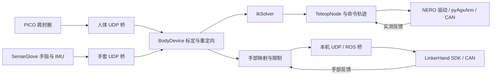
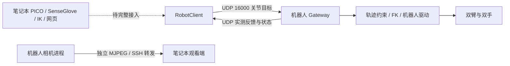

# ESROBO 项目结构与内容分析

分析日期：2026-09-22。依据本次克隆的代码、配置、包清单和各目录 Markdown 文档；未执行真机控制，也未进行整个 ROS 工作空间的编译。

**1. 克隆结果与版本**

- 本地目录：`/home/ddc/DualArmTeleoperation`，直接作为仓库根目录。
- 远程：`https://github.com/SaluteYan/esrobo.git`。
- 分支：`main`。
- 提交：`3f165cbba2143eb8794f20fb7ee329ca53aed417`。
- 提交说明：新增分布式遥操作通信及双臂双手控制。
- 保留上游代码和配置；本次新增本分析文档，未提交或推送。

子模块处理结果：

| 目录 | 本地版本 | 处理方式 |
| --- | --- | --- |
| `src/ranger_ros2` | `b6ea21a275ca5e7168130cc6470e61474681d679` | 按主仓库记录初始化 |
| `src/realsense-ros` | `e11d3e154ce3817c8be73f36b87a75f287e080e5` | 按主仓库记录初始化 |
| `src/ugv_sdk` | `c3dfaf444f9bae10757e546acae055aaf4a13de7` | 根据 Ranger README 提供的官方地址单独克隆，检出主仓库记录的提交 |

`ugv_sdk/test/googletest` 也已按该 SDK 记录初始化。上游根目录 [.gitmodules](.gitmodules) 缺少 `ugv_sdk` 的映射，未修改这一上游文件；因此根目录通用 `git submodule status/update` 仍可能报缺少映射，虽然对应源码现已存在且版本匹配。

**2. 项目定位**

这是一个面向 ESROBO 移动仿人形双臂机器人的集成工作空间，主要环境是 Ubuntu 22.04、ROS 2 Humble 和 Python 3.10。硬件覆盖 Ranger Mini 3 底盘、双 NERO 七轴臂、三轴腰部、头部舵机、双 LinkerHand、RGB-D 相机、激光雷达和六维力传感器。

整体由三层组成：

1. `src/`：ROS 2 硬件驱动、第三方 SDK、设备启动及标定工具。
2. `teleoperation/`：人体输入、标定、重定向、逆运动学、运动约束和实机控制。
3. `robot_link/`：笔记本发送已求解关节目标、机器人执行并回传反馈的通信层。

`teleoperation/` 与 `robot_link/` 均有独立 `pyproject.toml`，不属于 `src/` 内普通 ROS 包。遥操作中的机械臂控制直接复用 `pyAgxArm`，灵巧手通常经过本机 UDP→ROS 桥；因此不能把整个项目理解为只靠 ROS topic 串联的系统。

**3. 顶层结构**

```text
DualArmTeleoperation/
├── README.md                    整机硬件、接线和逐部件调试说明
├── src/                         ROS 2 包及厂家 SDK
├── teleoperation/               实机遥操作计算与控制
├── robot_link/                  分布式通信、网关和客户端
├── document/                    三份设备/整机 PDF 手册
├── start_can.sh                 CAN 接口重命名、波特率配置
├── 99-fixed-can.rules           USB/CAN/串口设备规则
├── .gitmodules                 顶层子模块清单，目前有缺项
└── PROJECT_ANALYSIS_CN.md        本分析
```

`document/` 包含整机操作手册、NERO 用户手册、RANGER MINI 3.0 用户手册。本次主要按代码与 Markdown 分析，未逐页审阅这些 PDF。

**4. src/ 各目录的作用**

| 目录 | 主要内容与代码依据 | 与当前主线的关系 |
| --- | --- | --- |
| `agx_arm_ros2/` | `agx_arm_ctrl` Python 节点、双臂 launch、`agx_arm_msgs`、描述包及 MoveIt 配置；主节点为 `agx_arm_ctrl_single_node.py` | NERO/Piper 的 ROS 接口；控制和反馈 topic 分离 |
| `pyAgxArm-master/` | Python CAN SDK，包含 NERO/Piper 协议、运动/状态 API、末端执行器、demos 和 tests | 遥操作直接调用的机械臂底层库 |
| `ranger_ros2/` | `ranger_base`、`ranger_bringup`、`ranger_msgs` | Ranger 底盘 ROS 2 接口与启动 |
| `ugv_sdk/` | C++ 移动底盘通信库 | `ranger_base` 的底层依赖 |
| `erob_can_joints/` | `erob_driver.cpp/.hpp`、`erob_driver_node.cpp`；包名 `erob_canopen` | 当前三轴腰部驱动；提供状态、使能、制动、位置/速度/力矩等 topic |
| `ros2_canopen_zero_diff/` | `config/`、`launch/`，依赖 `canopen_402_driver`、`canopen_ros2_control` | 另一条 CANopen 配置式接入路径，不是上述自定义腰部驱动源码 |
| `linkerhand-ros2/` | 手部 SDK、单/双手 launch、GUI、压力可视化、型号示例和 topic 文档 | 双灵巧手驱动与反馈 |
| `ros2_rs485_servo/` | `rs485_servo_driver.cpp`、`HeadJog.srv`、`ServoCmd.msg` | 头部云台；当前节点有 `/head/state`、`/head/adjust_enable`、`/head/jog` 接口 |
| `ros2_rs422_ftsensor/` | 串口/TCP 驱动、`kw_ft_node.cpp`、双传感器 launch | 左右六维力/力矩与连接状态发布，包名 `kw_ft_sensor_ros2` |
| `OrbbecSDK_ROS2/` | `orbbec_camera`、消息、模型、设备 launch 和 examples | 头部 Gemini 435Le RGB-D 相机 |
| `realsense-ros/` | RealSense 相机、消息、描述及附属工具包 | 腕部 RealSense 相机支持 |
| `rslidar_sdk-main/` | 雷达 ROS 包与已随主仓库提交的 `src/rs_driver` 驱动内核 | RoboSense Fairy 等型号的数据解码与点云发布 |
| `rslidar_msg-master/` | 雷达包消息，保留 ROS 1/ROS 2 目录 | 雷达驱动的消息依赖 |
| `aruco_ros-humble-devel/` | `aruco`、`aruco_ros`、`aruco_msgs`；单/双标记检测 launch | 视觉标记检测、位姿与标定输入 |
| `easy_handeye2-master/` | 标定节点、GUI、消息和 TF 发布 | 眼在手上/眼在手外的手眼标定 |
| `slam_launch/` | 底盘、雷达、静态 TF、Cartographer、RViz 启动组合 | SLAM 集成入口；不含完整自主导航系统 |
| `dual_ur_robot/` | 双 UR7e 控制 launch、MoveIt 与控制器配置 | 与当前 NERO 主线不同的 UR 机器人配置 |
| `ur_start/` | `ur_start.cpp`，通过 TCP 29999 发 Dashboard 命令 | UR 自动上电、松刹车等辅助节点，使用固定 IP |
| `esrobo_system/` | 保留力传感器相关源码；CMake 主要安装资源 | 集成目录尚不完整，不能按名称假定它是有效整机入口 |

实际整机组合入口位于 [start_esrobo_system_launch.py](src/ros2_rs485_servo/launch/start_esrobo_system_launch.py)，会启动腰部、双臂、底盘、雷达、头部、双手、双力传感器；其中 RealSense 启动片段当前被注释。根 README 建议先逐部件调试；代码中 `agx_arm_ctrl` 的 `auto_enable` 默认值为 `True`，这一建议与实际启动行为有关。

**5. teleoperation/：核心算法与控制**

| 路径 | 职责 |
| --- | --- |
| [config/teleop_config.yaml](teleoperation/config/teleop_config.yaml) | CAN/固件、关节映射、运动限制、重定向、IK、手部标定与反馈参数 |
| [src/esrobo_teleop/config.py](teleoperation/src/esrobo_teleop/config.py) | 配置数据类、默认值与 YAML 加载 |
| [src/esrobo_teleop/teleop_node.py](teleoperation/src/esrobo_teleop/teleop_node.py) | 主循环、模式选择、参考采集、使能、停止、故障和回零协调 |
| [device/body_device.py](teleoperation/src/esrobo_teleop/device/body_device.py) | UDP 输入、人体参考、坐标变换、骨段方向重定向、预测/滤波、IMU 处理 |
| [ik/solver.py](teleoperation/src/esrobo_teleop/ik/solver.py) | Pinocchio 模型、分区位置 IK、其他模式的 Pink IK |
| [robot/nero_driver.py](teleoperation/src/esrobo_teleop/robot/nero_driver.py) | NERO SDK 适配、单臂/双臂/手腕驱动、物理坐标映射、反馈和运动检查 |
| [robot/command_trajectory.py](teleoperation/src/esrobo_teleop/robot/command_trajectory.py) | 根据目标、上一命令与反馈生成满足限制的中间命令 |
| [robot/command_backpressure.py](teleoperation/src/esrobo_teleop/robot/command_backpressure.py) | 反馈等待/背压辅助逻辑；当前左右臂相应开关默认关闭 |
| [robot/torso_collision.py](teleoperation/src/esrobo_teleop/robot/torso_collision.py) | 基于模型的臂/手与躯干几何检查 |
| [robot/return_planner.py](teleoperation/src/esrobo_teleop/robot/return_planner.py) | 受约束回零路径规划 |
| [robot/hand_geometry.py](teleoperation/src/esrobo_teleop/robot/hand_geometry.py) | 手反馈对应几何及未知姿态包络 |
| [robot/linker_hand_driver.py](teleoperation/src/esrobo_teleop/robot/linker_hand_driver.py) | 手关节顺序/单位映射、十轴目标、反馈门禁、活动轴与速度限制 |
| `bridges/` | XRoboToolkit/IsaacTeleop→人体 UDP、SenseGlove ROS→手部 UDP、手命令 UDP→ROS |
| `scripts/` | 环境、SDK、模式启动、标定、诊断、离线输入、相机和模型下载工具 |
| `src/esrobo_teleop/debug/`、`web/` | 骨架网页、头部控制、CAN/关节诊断和异步日志 |
| `tests/` | 18 个测试文件与现场回归数据，覆盖 IK、轨迹、反馈、回零、手部/IMU 和桥接 |
| `urdf/`、`assets/` | 整机运动学 URDF 和碰撞资源来源清单 |

一体式运行的数据流为：



需要以实现为准的几个细节：

- **单臂模式并非全程 Pink IK。** 当前分区路径使用 `scipy.optimize.least_squares`，基于真实 URDF 联合拟合肘点和手基座位置。J1–J4 参与位置求解；近直臂时约束 J3。纯 PICO 模式 J5–J7 保持实测值，联合模式使用手套 IMU 方向目标。其他路径仍保留 Pink 任务速度求解。
- **整机模型不等于全身协同控制。** IK 输出 14 个臂关节，腰部和头部采用固定模型配置；底盘、腰部、头部驱动存在，但没有因此自动接入全身遥操作。
- **手模型与物理通道数量不同。** 当前 L20Lite 使用 SDK 的 L10 十主动轴接口，URDF 通过 mimic 描述被动关节；物理命令为 0–255 整数，不能直接发送弧度或把模型二十关节当二十独立执行器。
- **当前运动发送模式是 MOVE_J。** 左右配置均为 `j`；CPV 和背压等待保留为可选路径。当前左固件配置为 `V112`，右为 `DEFAULT`。
- **50 Hz 是目标周期。** `ik.dt=0.02`、手部发布上限 50 Hz，不代表实机必然达到稳定硬实时频率。
- **几何检查分阶段启用。** `torso_collision_enabled=true`，但 `teleop_torso_collision_enabled=false`；启动与慢速回零保留几何检查，实时跟随并非默认持续执行该躯干检查。控制器碰撞等级、力矩和轨迹限制是另外的保护层。

**6. robot_link/：分布式通信**

| 文件 | 职责 |
| --- | --- |
| [protocol.py](robot_link/esrobo_link/protocol.py) | JSON/HMAC-SHA256 封装、包长/字段/目标范围校验 |
| [session.py](robot_link/esrobo_link/session.py) | 独占会话、递增序号、令牌有效期、最新目标缓存 |
| [gateway.py](robot_link/esrobo_link/gateway.py) | UDP 网络线程、串行执行、看门狗、状态机和 JSONL 日志 |
| [backends.py](robot_link/esrobo_link/backends.py) | 单/双侧模拟及硬件后端；复用遥操作驱动和保护逻辑 |
| [client.py](robot_link/esrobo_link/client.py) | 笔记本 `RobotClient`，单侧/双侧目标与反馈接口 |
| [monitor.py](robot_link/esrobo_link/monitor.py) | 只读通信检查；使用同一独占会话机制 |
| [camera.py](robot_link/esrobo_link/camera.py) | ROS JPEG 转发或 RealSense 采集，独立 MJPEG HTTP 通道 |
| [examples/laptop_integration.py](robot_link/examples/laptop_integration.py) | 输入新鲜度、使能保持与求解帧接入示例 |
| `tests/` | 协议、会话、超时、双侧故障、真实本机 UDP 和 HTTP 测试 |

设计部署关系如下。笔记本完整应用与 SDK 的连接仍待完成，图中以虚线表示：



已实现支持单臂、单臂加同侧手、`--side both` 双臂加双手；默认模拟，真实设备需要 `--hardware`。客户端/模拟后端仅需 Python 3.10+ 标准库，真实后端仍依赖 `teleoperation` 和机器人环境。

协议与执行边界：

- 控制 UDP 默认 16000；本机手桥默认 15051、手反馈 15052；相机 HTTP 默认 loopback 18080。
- 目标数据经过认证、会话、序号、配置指纹、范围和默认 200 ms 令牌校验；只保留最新目标。HMAC 不加密内容。
- 网络臂目标是 URDF 弧度，电机方向/偏置只在机器人端转换一次。
- `accepted_seq` 只表示协议接纳，实测反馈才说明实际执行状态。
- 状态包括 `IDLE`、`ARMING`、`ACTIVE`、`FAULT`、`RETURNING`；机器人现场 `e` 才允许使能，重连不自动恢复。
- 双侧模式先校验四部件完整目标，硬件仍依次发送两臂再发送双手，不具有硬件原子提交或同步保证。
- 双侧自动回零 `z` 明确不支持，因为当前回零模型未覆盖完整双臂互撞；单臂回零保留。
- 图像首版只提供彩色 JPEG，不包含深度、内参或两机时钟自动同步。

**7. laptop_teleop/：本机采集、计算与发送**

`laptop_teleop/` 已把分布式方案的本机一侧整理成独立 Python 包。PICO 经本机 XRoboToolkit PC Service 和 Python SDK 产生双侧骨骼输入；SenseGlove 经 SenseCom 与 ROS 2 Humble 产生手指和 IMU 输入。两路数据在本机按真实采样时间合并，复用 `teleoperation` 的参考标定、重定向、分区 IK 与手指映射，再由 `RobotClient` 发往 `192.168.10.100:16000`。

| 路径 | 职责 |
| --- | --- |
| `laptop_teleop/environment.yml` | `esrobo_laptop` Conda 环境，固定 Python、Pinocchio、SciPy 等版本 |
| `config/laptop.yaml` | 机器人地址、受控侧、密钥路径、输入/反馈时限和频率 |
| `src/esrobo_laptop/acquisition.py` | 给原 PICO/SenseGlove 桥增加来源、物理侧和单调采样时间 |
| `inputs.py` | 合并两路 UDP，拒绝重复、缺侧、过期或伪造的完整帧 |
| `pipeline.py` | PICO 参考、人体重定向、IK、手腕 IMU 与手指目标计算 |
| `contract.py` | 校验本机与网关的配置指纹、关节语义和 mock/实机边界 |
| `app.py` | `check`、`inspect`、`run`、预览、日志和停止处理 |
| `dashboard.py` / `web/` | 统一网页控制台：本机 PTY 进程、机器人 SSH/tmux、标定交互、模式选择、状态和相机转发 |
| `scripts/` | Conda、PICO、SenseGlove 安装以及逐进程启动和检查 |
| `docs/` | 首次部署、SSH/密钥、日常操作和排障手册 |

本机不直接接触机器人 CAN 或 LinkerHand ROS 驱动，也不通过网络发送电机坐标。目标保持为七轴 URDF 弧度与手部十轴 0–255 值；机器人端负责物理映射、反馈、安全限制、使能状态机与执行。

网页入口为 `laptop_teleop/scripts/run_dashboard.sh`，操作说明见 [网页控制台文档](laptop_teleop/docs/05_WEB_CONSOLE.md)。网页通过 SSH 复用机器人端 `e/s/x/d/z/q` 人工命令，不改变 UDP 协议；不会自动使能。机器人监控读取活动网关日志，本机计算输出不含密钥的实时状态文件，避免额外客户端争抢通信会话。相机沿用现有彩色/深度预览及两轴限位调整。

**8. 文档怎么读**

| 目的 | 入口 |
| --- | --- |
| 了解整机接线、设备和调试次序 | [根 README](README.md) |
| 了解遥操作目录与基本安装 | [teleoperation/README.md](teleoperation/README.md) |
| 看当前启动、标定、按键和排障 | [TELEOPERATION_RUNBOOK.md](teleoperation/TELEOPERATION_RUNBOOK.md) |
| 理解当前算法、执行逻辑与状态机 | [TELEOPERATION_RUNTIME_LOGIC.md](teleoperation/TELEOPERATION_RUNTIME_LOGIC.md) |
| 查修改历史与故障背景 | [TELEOPERATION_CHANGELOG.md](teleoperation/TELEOPERATION_CHANGELOG.md) |
| 分布式部署和支持范围 | [robot_link/README.md](robot_link/README.md) |
| 本机计算端结构与边界 | [laptop_teleop/README.md](laptop_teleop/README.md) |
| 本机安装、SSH、启动和排障 | [laptop_teleop/docs/](laptop_teleop/docs/README.md) |
| 网络字段、单位、有效期与状态 | [PROTOCOL.md](robot_link/PROTOCOL.md) |
| 收到目标之后机器人如何执行 | [ROBOT_EXECUTION.md](robot_link/ROBOT_EXECUTION.md) |
| 区分已有离线验证与待实机验收 | [DEVELOPMENT.md](robot_link/DEVELOPMENT.md) |
| 查厂家接口 | 各 SDK README、`pyAgxArm-master/docs/nero/nero_api.md`、`linkerhand-ros2/doc/Topic-Reference.md` |

运行细节优先交叉检查当前代码、YAML 和运行逻辑文档。README 的概要及 changelog 的旧条目可能描述之前的行为，例如 Pink 路径、CPV/背压模式和停止按键语义；原一体式入口与新网关的按键行为也不同。

**9. 本次确认的完整性与部署缺口**

| 发现 | 证据及影响 |
| --- | --- |
| 顶层 `ugv_sdk` 子模块映射缺失 | Git 记录 gitlink，但 `.gitmodules` 只有 Ranger、RealSense；本地已按精确提交补齐，仓库元数据仍需后续修复 |
| 根 README 中 `model/` 不存在 | 当前可以使用 `teleoperation/urdf/esrobo_waist_with_head.urdf` 读取运动学；不能按根 README 的模型路径直接运行 |
| 碰撞 meshes 未随仓库提交 | `assets/.../SOURCE.json` 列出 61 个文件，本地均缺失，合计 327,266,524 bytes，约 327 MB；`TorsoCollisionGuard` 找不到时明确报错 |
| 有模型下载工具但未执行 | `teleoperation/scripts/fetch_collision_meshes.py` 从另一仓库的固定提交取模型并校验几何、大小和哈希；本次未额外下载这些外部资源 |
| 机械臂描述包缺少 `agx_arm_urdf/` | `agx_arm_description/CMakeLists.txt` 要安装该目录，实际不存在；其上层保留的 `.gitmodules` 不是根仓库有效 gitlink，顶层递归克隆不能补齐 |
| `esrobo_system/launch` 不存在 | CMake 声明安装该目录，但仓库没有；全工作空间构建的安装阶段可能受阻，未实际编译验证 |
| 启动脚本包含原机器路径 | 默认 `/home/esrobo/Projects/esrobo`、`/home/esrobo/miniconda3` 与当前目录不同；需检查 `ESROBO_WS`、`MINICONDA_DIR`、`PYAGXARM_PATH` 等支持的覆盖项 |
| Pink 依赖说明与安装脚本不一致 | 遥操作 README 提醒需要机器人 IK 的官方 Pink，而脚本及包清单仍使用名称 `pink`；安装前应核对 `from pink import solve_ik`，不能只以 `import pink` 成功为准 |
| 外部人体输入 SDK 不提交到仓库 | 本机已把 XRoboToolkit、SenseCom/SenseGlove 安装到 `laptop_teleop/external/` 或系统目录；脚本可重建，外部源码与构建产物被 Git 忽略 |
| 手反馈几何标定为空 | `hand.geometry_feedback_calibration: {}`；手开合命令标定不能替代反馈到 URDF 的几何标定，联合启动或回零可能被拒绝 |
| 双机实机验收仍需现场设备 | 本机采集、标定、IK、协议客户端及环境已实现并通过无硬件闭环；仍需接入实际 PICO、两只手套并登录机器人验证方向、采样率、局域网延迟和物理运动 |

以上属于当前版本的实际边界。源码克隆成功并不表示模型、外部 SDK、机器配置和完整部署已经准备完毕。

**10. 本次验证及范围**

已经执行：

```bash
cd /home/ddc/DualArmTeleoperation
PYTHONPATH=robot_link python3 -m unittest discover -s robot_link/tests -v
```

早期通信专项结果为 **28 项测试通过**。完成本机计算端后，使用 `esrobo_laptop` Conda 环境执行整合测试，结果为 **57 passed、39 subtests passed、2 deselected**，覆盖本机采集合同、双侧 IK、真实本机 UDP、网关状态机、输入停止后的 lease 故障以及通信回归。两项 deselected 需要当前未下载的完整碰撞 meshes。

另外检查了主仓库/三个顶层子模块版本、目录/包清单、关键配置和 URDF。随仓库提供的遥操作 URDF 可解析，包含 **72 个 link、71 个 joint**，根 link 为 `base_link`。本机已创建 Python 3.10 Conda 环境，Pinocchio 模型自由度为 **59**；XRoboToolkit SDK 可导入，PC Service 正在 TCP 60061 监听；SenseGlove ROS 的 10 个包已构建且消息可由系统 Python 导入。

未执行整个机器人 ROS 工作空间的全量构建、外部碰撞模型下载或任何设备使能/运动。PICO 头显、实际 SenseGlove 数据和 `192.168.10.100` 机器人主机尚未接入，因此当前结论不等同于实机运动验收。

**11. 后续开发切入点**

若目标是继续双臂遥操作开发，可以按以下次序推进：

1. 先整理子模块元数据、描述资源和环境路径，使新机器能稳定复现环境。
2. 从 `config.py` → `body_device.py` → `ik/solver.py` 理解输入如何变成 URDF 关节目标。
3. 从 `teleop_node.py` → `command_trajectory.py` → `nero_driver.py` 理解使能门禁、反馈约束和下发链路；手部另看 `linker_hand_driver.py`。
4. 按 `laptop_integration.py` 接入 `RobotClient`，保留人体输入新鲜度、启动保持目标、正确关节顺序和单位。
5. 完成模型/反馈几何标定后，再分别验证单臂、同侧臂手、双臂双手；双机网络与实机执行应单独验收。
