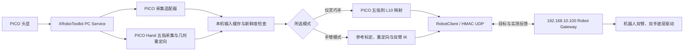

# ESROBO 本机遥操作计算端

`laptop_teleop` 在本机统一采集 PICO 全身骨骼与光学手部追踪，完成参考标定、人体到机器人重定向和双臂逆运动学，再通过 `robot_link` 协议把七轴关节目标与十轴手目标发送给机器人主机 `192.168.10.100:16000`。机器人主机负责协议校验、安全状态机、反馈与底层硬件执行。当前遥操作不再依赖 SenseGlove，旧手套输入被计算端忽略。

PICO Body 的 24 关节提供肩、肘和手腕整体姿态；五指来自同一 SDK 的独立 Hand 26 点追踪，不能由 24 点全身骨架推导。迁移与操作见 [`docs/06_PICO_HAND_INPUT.md`](docs/06_PICO_HAND_INPUT.md)。

详细安装和每日操作命令集中在 [`docs/`](docs/README.md)。首次部署按文档 01→02→03 的顺序执行。

统一网页控制台负责本机与机器人程序管理、模式选择、标定交互、使能/停止、反馈与日志展示，并通过 SSH 接入现有相机和头部调整页面。网页操作见 [`docs/05_WEB_CONSOLE.md`](docs/05_WEB_CONSOLE.md)。

## 系统边界



SSH 用于机器人程序管理、操作员网关命令、日志读取及相机 HTTP 转发。运动目标走 UDP 16000；共享密钥提供消息认证，不加密运动数据。PICO、IK 和网页控制台均在本机运行，CAN、LinkerHand 和相机 ROS 驱动运行在机器人主机。

## 目录结构

```text
laptop_teleop/
├── README.md                 项目结构、模块与数据流
├── docs/                     安装、部署、运行和排障操作文档
├── environment.yml          Conda 环境 esrobo_laptop
├── config/laptop.yaml       机器人地址、模式、输入与反馈时限
├── src/esrobo_laptop/
│   ├── acquisition.py       PICO Body/Hand 采集、独立采样与 UDP 发布
│   ├── pico_hand.py         26 点手部追踪到灵巧手十轴的几何映射
│   ├── inputs.py            UDP 输入合并、来源与采样时间检查
│   ├── pipeline.py          参考采集、重定向、IK、手指映射流水线
│   ├── mapping.py           手指十轴输出及未控制轴保持
│   ├── contract.py          本机与机器人配置合同校验
│   ├── config.py            laptop.yaml 与机器人配置加载
│   ├── app.py               inspect/check/run 主程序
│   ├── dashboard.py         本机 HTTP 控制台、SSH/tmux 与进程管理
│   └── demo.py              无硬件本机闭环演示
├── scripts/
│   ├── setup_all.sh         Conda、PICO、SenseGlove 一次安装
│   ├── install_env.sh       安装 Miniforge并创建 Conda 环境
│   ├── install_pico.sh      安装 PC Service并编译 Python SDK
│   ├── install_senseglove.sh 构建 SenseGlove ROS 工作空间
│   ├── check_environment.sh 环境完整性检查
│   ├── xrobotoolkit_service.sh 管理 PICO PC Service
│   ├── configure_senseglove.sh 写入左右手套序列号
│   ├── run_sensecom.sh      启动 SenseCom
│   ├── run_senseglove_ros.sh 启动手套 ROS 驱动
│   ├── run_pico.sh          发布带原始采样时间的 PICO 输入
│   ├── run_senseglove.sh    标定并发布手指/IMU 输入
│   ├── run_laptop.sh        检查、预览或连接机器人运行
│   ├── run_dashboard.sh     一条命令启动网页遥操作控制台
│   └── test.sh              本机、通信和 IK 回归测试
├── tests/                   本机整合测试
├── web/                     控制台页面、样式与浏览器状态控制
├── external/                外部 SDK/ROS 源码与构建产物（Git 忽略）
└── log/                     会话、PICO参考和服务日志（Git 忽略）
```

## 处理流程

1. `run_pico.sh` 从 `xrobotoolkit_sdk` 读取左右肩、肘、腕等骨骼点，复用 `teleoperation/bridges/xrobotoolkit_body_udp_bridge.py` 生成 `arm_vector`。
2. 同一采集进程独立读取每侧 PICO Hand 的 26 个关节、有效标记、时间戳和接收序号，映射为十轴手指弯曲/侧摆目标。
3. 两类数据通过 `127.0.0.1:15050` 传输，分别标记 `pico` / `pico_hand`。带手臂模式仅在所选侧的肩肘腕、五指与手腕姿态均有效且未超时后计算；仅灵巧手模式只要求所选侧 `pico_hand`。不使用通用 XR 时间戳刷新手指缓存。
4. `pipeline.py` 复用人体参考、骨段重定向和分区位置 IK。J1–J4 跟随肩肘腕目标；带手模式 J5–J7 使用相对标定零位的 PICO 手腕旋转；手指映射为 LinkerHand L10 的 0–255 十轴值。纯单臂模式保持末端三轴反馈值。
5. `app.py` 每次求解前后检查输入与机器人状态新鲜度，通过 `RobotClient` 发送带序号、会话令牌、配置指纹和 HMAC 的目标。仅灵巧手目标包没有机械臂字段，机器人网关还会持续确认七个手臂驱动均为失能。机器人端仍执行手部步长、速度、反馈和 lease 门禁。

## 运行模式

| 用途 | 本机参数 | 机器人网关参数 | 所需输入 |
| --- | --- | --- | --- |
| 双臂双手 | 默认 | `--side both` | 双侧 PICO Body + Hand |
| 左臂左手 | `--side left` | `--side left --with-hand` | 左侧 PICO Body + Hand |
| 右臂右手 | `--side right` | `--side right --with-hand` | 右侧 PICO Body + Hand |
| 纯左臂 | `--side left --arm-only` | `--side left` | 左侧 PICO |
| 纯右臂 | `--side right --arm-only` | `--side right` | 右侧 PICO |
| 仅左灵巧手 | `--side left --hand-only` | `--side left --with-hand --hand-only` | 左侧 PICO Hand |
| 仅右灵巧手 | `--side right --hand-only` | `--side right --with-hand --hand-only` | 右侧 PICO Hand |

默认配置见 [`config/laptop.yaml`](config/laptop.yaml)：机器人地址为 `192.168.10.100`、端口为 `16000`，计算上限 50 Hz，人体输入最长 100 ms，机械臂和灵巧手反馈最长 150 ms。机器人端 LinkerHand ROS 驱动约 59 Hz 发布状态，非阻塞通信桥以相同频率转发给网关。机器人端的 URDF、关节映射、手部映射和安全配置必须与本机引用的 `teleoperation/config/teleop_config.yaml` 一致，否则合同校验拒绝运行。

## 安全与故障语义

本机不会在启动程序时自动使能机器人。启动正式计算后，操作员在网页点击“使能并准备”并确认，或在机器人 SSH 网关终端输入 `e`，才启动受检流程：所选灵巧手先限速回到自然张开位并核对十轴反馈，机械臂随后规划回零并验证七轴失能；随后 PICO 要求操作者把前臂抬到胸前、肘部自然弯曲、双手自然张开。连续稳定检测完成后，首帧映射到机器人零位，网关再次检查目标匹配才自动进入 `ACTIVE`。PICO 人手无需单独保存零位文件。双臂模式仍因缺少双臂互碰扫掠检查而拒绝自动回零；应使用经过现场验证的双臂恢复流程。输入过期、反馈异常、IK 失败、网络中断或配置变化会停止本次会话。仅灵巧手模式不会使能或下发手臂目标；检测到任一手臂轴使能会立即终止。网页顶部和遥操作区均可停止运动；设备区还可分别失能左臂、右臂、双手命令和头部舵机。

## 文档入口

- [`docs/01_ENVIRONMENT_SETUP.md`](docs/01_ENVIRONMENT_SETUP.md)：Conda、ROS 2、PICO、SenseGlove 安装与本机当前状态。
- [`docs/02_ROBOT_CONNECTION.md`](docs/02_ROBOT_CONNECTION.md)：网络、SSH、共享密钥与机器人网关。
- [`docs/03_OPERATION_RUNBOOK.md`](docs/03_OPERATION_RUNBOOK.md)：从设备连接到安全停止的逐终端操作命令。
- [`docs/04_TROUBLESHOOTING.md`](docs/04_TROUBLESHOOTING.md)：检查命令、常见故障、日志与恢复。
- [`docs/05_WEB_CONSOLE.md`](docs/05_WEB_CONSOLE.md)：统一网页启动、连接、标定、模式选择、相机、状态与控制。
