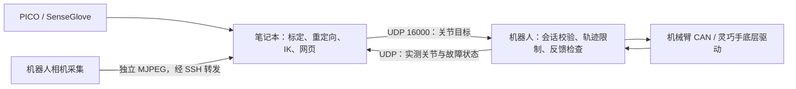

# ESROBO 分布式遥操作通信

此目录将“笔记本计算目标”和“机器人执行目标”分开。笔记本为 Ubuntu/Linux。
通信协议详见 [PROTOCOL.md](PROTOCOL.md)，机器人收到目标后的完整执行过程见
[ROBOT_EXECUTION.md](ROBOT_EXECUTION.md)，开发和验收记录见 [DEVELOPMENT.md](DEVELOPMENT.md)。

## 目录

- [收到关节目标后的执行过程](ROBOT_EXECUTION.md)
- [职责与当前范围](#职责与当前范围)
- [先做无硬件通信检查](#先做无硬件通信检查)
- [部署机器人端](#部署机器人端)
- [双臂＋双手模式](#双臂双手模式)
- [接入笔记本计算程序](#接入笔记本计算程序)
- [图像采集和传输](#图像采集和传输)
- [停止恢复和诊断](#停止恢复和诊断)

## 职责与当前范围



| 所在位置 | 负责工作 |
| --- | --- |
| 笔记本 | PICO、SenseCom/SenseGlove、人体标定、重定向、IK、网页骨架和数据显示 |
| 机器人主机 | CAN 通信、实测反馈、原有关节速度/加速度/跟随差/力矩检查、显式安全回零、相机采集 |
| 网络 | 已计算目标和实测状态；不传控制器原始 CAN 帧，不在机器人运行人体 IK |

机器人端仍保留 FK 和碰撞模型，供末端速度限制、启动检查和安全回零使用。未调整原有速度、关节范围、力矩阈值或控制模式；实时跟随是否检查碰撞沿用配置。

**支持单侧机械臂、可选同侧 L10 灵巧手、单侧仅灵巧手，以及双臂＋双手。** 单侧使用 `--side left/right`，仅灵巧手再增加 `--with-hand --hand-only`，四部件联合使用 `--side both`（自动包含双手）。所有模式默认模拟，真实硬件必须显式 `--hardware`。双侧必须使用一个网关，禁止启动两个单侧网关。仅灵巧手合同拒绝机械臂目标，网关只使能所选手，并持续验证对应机械臂七轴全部失能。腰部、头部保持原模型固定前提。
笔记本 PICO/SenseGlove 采集、重定向、分区 IK 和客户端入口已整理到 [`laptop_teleop`](../laptop_teleop/README.md)，默认机器人地址为 `192.168.10.100`。本机骨架查看沿用 PICO 采集桥；两机真实设备联调仍待完成。旧脚本仍是原来的本机一体运行方式。
负载拆分不能证明此前整机崩溃已解决，操作系统卡死时 Python 看门狗也无法执行。

## 先做无硬件通信检查

以下命令从仓库根目录执行。笔记本只需 Python 3.10+；SDK/模拟网关不依赖 ROS、NumPy、GPU、CAN 或机器人 SDK。

```bash
python3 -m venv .venv-robot-link
source .venv-robot-link/bin/activate
python3 -m pip install -e ./robot_link
mkdir -p ~/.config/esrobo
(umask 077; python3 -c 'import secrets; from pathlib import Path; p=Path.home()/".config/esrobo/robot-link.key"; f=p.open("x"); f.write(secrets.token_hex(32)+"\n"); f.close()')
```

密钥命令仅首次运行；文件已存在时拒绝覆盖。通过 SSH/SCP 将同一文件复制到另一台机器的同一路径，设置 `chmod 600 ~/.config/esrobo/robot-link.key`。不要提交密钥到仓库。

终端 A（模拟，不接触硬件）：

```bash
python3 -m esrobo_link.gateway --side left --with-hand \
  --key-file ~/.config/esrobo/robot-link.key
```

终端 B（只读，不发送关节目标）：

```bash
python3 -m esrobo_link.monitor --host 127.0.0.1 \
  --key-file ~/.config/esrobo/robot-link.key --seconds 10
```

应看到 `IDLE`、合同 `mock-v1-left-True` 和模拟反馈。只读监视器不会自动使能，也不是持续跟随客户端；它占用本次会话，不要同时启动另一个控制客户端。

跨机器模拟时，A 加 `--bind <机器人局域网IP>`，B 改 `--host <机器人局域网IP>`。UDP 16000 需要双向可达；推荐同一有线局域网。HMAC 提供认证与完整性，不加密关节数据；不要直接暴露公网，需要跨网时使用受控 VPN。SSH 的普通 `-L` 不转发 UDP。

运行离线测试：

```bash
PYTHONPATH=robot_link python3 -m unittest discover -s robot_link/tests -v
```

## 部署机器人端

### 1. 先结束旧控制进程

不能与旧遥操作、厂家运动控制程序或另一个 CAN 控制器同时运行。新网关有进程锁，但旧程序不遵守该锁；必须人工核对。网关初始化会调用原驱动连接流程，可能失能，接触真机前应托稳机械臂。

本轮没有启动真机、使能或运动。先验证两机模拟通信，再做现场硬件验收。

### 2. 可选：只启动灵巧手底层与本机桥

仅 `--with-hand` 需要以下服务，两个终端分别运行。以下是左手；右手改为 `hand_type:=right`、`can:=can_hand1`、`--side right`。
CAN 接口初始化按原[运行手册](../teleoperation/TELEOPERATION_RUNBOOK.md)准备，不运行旧联合启动脚本，避免又在机器人启动 SenseCom/PICO/网页。

```bash
source /opt/ros/humble/setup.bash
source install/setup.bash
export RMW_IMPLEMENTATION=rmw_cyclonedds_cpp
ros2 run linker_hand_ros2_sdk linker_hand_sdk --ros-args \
  -r __node:=linker_hand_sdk_left \
  -p hand_type:=left -p hand_joint:=L10 -p is_touch:=false \
  -p can:=can_hand2 -p move_on_start:=false -p modbus:=None
```

```bash
source /opt/ros/humble/setup.bash
source install/setup.bash
export RMW_IMPLEMENTATION=rmw_cyclonedds_cpp
python3 teleoperation/bridges/hand_ros_bridge.py --port 15051 --side left
```

15051/反馈端口只供机器人本机桥使用，笔记本统一连接 16000。手指目标仍经过本机活动轴掩码、步长和速度限制。反馈零位与手指几何映射是不同配置；当前 L20Lite 使用 L10 十轴映射，网关状态必须报告所选侧 `10/10`，否则启动/回零会拒绝，网络模式不跳过这些检查。

### 3. 启动真实网关

在机器人仓库根目录、交互式 tmux 终端运行（将 IP 替换为实际值）：

```bash
PYTHONPATH="$PWD/robot_link:$PWD/teleoperation/src" \
  /home/esrobo/miniconda3/envs/teleop_esrobo/bin/python \
  -m esrobo_link.gateway \
  --hardware --side left --with-hand --bind <机器人局域网IP> \
  --config "$PWD/teleoperation/config/teleop_config.yaml" \
  --key-file ~/.config/esrobo/robot-link.key
```

纯机械臂去掉 `--with-hand`，也不要启动上面的手驱动。右臂用 `--side right`。真实网关不启动 PICO、SenseGlove、IK 或网页。

启动打印 `contract`，包含关节顺序、URDF 弧度限位、电机映射、速度/加速度及配置指纹。核对笔记本模型和标定后保存该指纹，客户端用 `expected_contract_id` 固定它。修改配置后需要重新核对，不能盲目接受新指纹。

单臂模式输入一次 `e` 后执行完整准备流程：灵巧手先限速回到经过反馈核对的自然张开位，机械臂随后沿受检路径回到 URDF 零位并确认七轴失能；随后网关进入 `CALIBRATING`，等待笔记本确认 PICO 胸前抬臂和自然张手姿态。笔记本发来与机器人零位匹配的首帧后，网关再次检查反馈和目标差值，再进入使能和跟随。准备期间输入 `s` 或 `x` 可取消并停止。控制器上电不发反馈时仍明确拒绝；先按旧手册在现场解决反馈问题。

真实双臂网关暂不接受这项自动准备，因为当前没有双臂互碰扫掠检查；`e` 会在运动前拒绝。双臂模式必须使用现场验证过的恢复流程。

## 双臂＋双手模式

从仓库根目录启动模拟网关，先验证网络：

```bash
PYTHONPATH=robot_link python3 -m esrobo_link.gateway --side both \
  --key-file ~/.config/esrobo/robot-link.key
```

`--side both` 必须带齐双臂和双手，不支持只更新一侧或省略某只手。笔记本使用一个 `RobotClient`、一个会话，四部件共用序号和有效期。任一人体输入过期，应停止整个目标流。

真实模式需要两个灵巧手底层 SDK 进程：按前文左手命令运行一次，再以 `right`、`can_hand1`、节点名 `linker_hand_sdk_right` 运行右手，二者都使用 `move_on_start:=false`。**只启动一个双手桥**，不要再运行两个单手桥：

```bash
source /opt/ros/humble/setup.bash
source install/setup.bash
export RMW_IMPLEMENTATION=rmw_cyclonedds_cpp
python3 teleoperation/bridges/hand_ros_bridge.py --port 15051 --side both
```

然后启动一个真实网关：

```bash
PYTHONPATH="$PWD/robot_link:$PWD/teleoperation/src" \
  /home/esrobo/miniconda3/envs/teleop_esrobo/bin/python \
  -m esrobo_link.gateway --hardware --side both --bind <机器人局域网IP> \
  --config "$PWD/teleoperation/config/teleop_config.yaml" \
  --key-file ~/.config/esrobo/robot-link.key
```

- 初始化各臂仍可能失能，必须同时托稳两臂。四个部件反馈、首目标和双手开位都通过预检查后，`e` 才依次使能两臂，最后开放双手发送；第二臂准备期间仍监测第一臂保持状态。
- ACTIVE 周期先读取两臂和双手反馈，再依次下发两臂目标，最后一次发送双手目标。四目标整包校验，硬件发送并非同时完成，不能宣称硬件同步或严格 50 Hz。
- 任一侧故障、断流或 `s/x/q` 都请求两臂停止，冻结双手新目标。第一臂停止发送失败仍尝试第二臂。`d` 会尝试失能两臂和双手；`dl`、`dr`、`dh` 分别只对左臂、右臂和双手执行失能。所有失能是否成功都以反馈为准。
- **双侧模式暂不提供 `z` 自动回零。** 现有碰撞模型只检查单臂与躯干，没有完整的两臂/手之间扫掠路径检查；直接拼接单臂回零可能互撞。`z` 明确拒绝且不发送回程目标，原单臂 `z` 保留。
- 双侧故障后不会自动解锁，需现场按现有硬件排障流程处理并重新启动网关；不要用切换到单臂网关来绕过另一个机械臂在路径中的实际障碍。运行范围应避开双臂交叉，不提供双臂互撞保护认证。

双侧 API（四个数组均为对应人体新帧的求解结果）：

```python
client.send_dual_target(
    left_arm_urdf_rad=q_left.tolist(), right_arm_urdf_rad=q_right.tolist(),
    left_hand_unit=hand_left.tolist(), right_hand_unit=hand_right.tolist(),
)
```

完整启用过程参照 `examples/laptop_integration.py` 中的 `send_dual_solved_frame`：分别传入
`left_arm/right_arm/left_hand/right_hand` 四路原始输入的本机接收时间；其中任一路过期就不发送。
IDLE/ARMING 发送四部件的实测保持姿态，ACTIVE 才发送求解目标。反馈位于
`state["feedback"]["sides"]["left"/"right"]`。可运行的笔记本计算入口及启动步骤见 [`laptop_teleop`](../laptop_teleop/README.md)。

## 接入笔记本计算程序

入口为 `esrobo_link.client.RobotClient` 和 [laptop_integration.py](examples/laptop_integration.py)。

```python
from esrobo_link import RobotClient

client = RobotClient(robot_ip, 16000, key_file,
                     expected_contract_id=commissioned_contract_id)
state = client.connect()
# 在每个新的、有效的人体求解帧执行：
state = client.receive(timeout=0.1)
client.send_target(arm_urdf_rad=q7.tolist(), hand_unit=hand10.tolist())
# 结束时：
client.close()  # 最佳努力 STOP；丢包时仍由机器人有效期看门狗处理
```

上面只展示 API，**使能阶段、人体输入新鲜度及反馈年龄的具体处理应采用示例函数**。不得在定时线程里无限重复最后一帧人体目标来维持网络有效期。输入丢失、求解异常时停止发目标或调用 `stop()`。

- 手臂目标是选定侧 J1–J7 的 **URDF 弧度**，不是角度，也不是电机原始角度。电机方向/偏置仅机器人应用一次。
- 手目标是 **L10 物理十轴顺序的 0–255 整数**，不是现有 `BodyDevice` 的手指弧度数组。笔记本需复用现有映射、标定和手指顺序；不要直接把弧度乘 255。
- 未带手时 `hand_unit=None`。Python/NumPy 数组使用 `.tolist()` 得到普通 Python 数值。
- IDLE/ARMING 先发实测姿态保持目标；机器人侧操作员明确 `e` 后，ACTIVE 才发人体求解目标。机器人会沿原有限速逐渐跟踪。
- 网页用 `feedback.arm_urdf_rad` 显示实际机器人，人体骨架/重定向目标/IK 结果在笔记本各自绘制；不能把接收成功当作已经到位。
- `accepted_seq` 仅表示通过协议校验；反馈才是执行结果。SDK 不会自动连接后使能、不自动重发、不自动回零。

## 图像采集和传输

图像独立进程，HTTP 仅监听机器人 `127.0.0.1:18080`。首版为彩色 JPEG；不包含深度、相机内参、硬件同步或 WebRTC。

已有 ROS 相机发布 JPEG `sensor_msgs/CompressedImage` 时，优先原样转发，避免再次编码（先用 `ros2 topic list` 核对主题）：

```bash
source /opt/ros/humble/setup.bash
export RMW_IMPLEMENTATION=rmw_cyclonedds_cpp
PYTHONPATH=robot_link python3 -m esrobo_link.camera --source ros \
  --topic /camera/color/image_raw/compressed
```

没有 ROS 相机进程时可直接 RealSense 采集；选用已安装 `pyrealsense2`、NumPy、OpenCV 的 Python 环境：

```bash
PYTHONPATH=robot_link python3 -m esrobo_link.camera \
  --source realsense --width 640 --height 480 --fps 15
```

同一相机不要同时用两种采集方式。直接采集仍有 CPU JPEG 编码开销，可从 6/15 fps 开始；显示、分析和网页合成移到笔记本。

笔记本建立 SSH 转发：

```bash
ssh -N -L 18080:127.0.0.1:18080 esrobo@<机器人局域网IP>
```

浏览器打开 `http://127.0.0.1:18080/stream.mjpg`，或笔记本网页用该 URL。每个图像包含帧号、时间戳、坐标帧名。RealSense 直采时间为主机到达时间；ROS 来源保留消息时间，仿真时钟下不能当真实 UTC。两机时间戳没有自动同步，不能直接相减作为精确延迟。
只保留最新一帧、最多两路观看、采集停滞结束连接；图像不会阻塞关节 UDP 通道。

## 停止恢复和诊断

新网关使用逐行终端输入，**以下按键需要 Enter**；与旧遥操作原始按键模式不同。

| 操作 | 行为 |
| --- | --- |
| `e` | 仅 IDLE + 新鲜保持目标 + 本机预检查通过时使能 |
| `s` / `x` | 停止跟随并请求电子停止，保持 FAULT 闭锁 |
| `d` | 请求失能两臂和双手，并记录是否确认；不回零 |
| `dl` / `dr` | 先停止当前会话，再仅失能左臂 / 右臂，并记录反馈确认结果 |
| `dh` | 先停止当前会话，再仅关闭双手命令输出 |
| `z` | 单侧：避碰规划、安全回零及失能；双侧：暂不支持，明确拒绝 |
| `r` | 故障后显式恢复：仅灵巧手核验失能与新鲜反馈后回到 IDLE；单臂复用 `z` 受检回零；双臂拒绝 |
| `q` / Ctrl+C / SIGTERM | 请求电子停止并退出，不隐式回零或自动失能 |
| 网络断流/目标有效期耗尽 | ACTIVE/ARMING 进入 FAULT，取消运动并请求电子停止 |

`stop_send_returned=true` 只表示调用返回，不是机械停止/失能证明。看实测反馈、七轴 `enable_states`、控制器状态；反馈过期时状态为未知。`dl/dr/dh` 会先闭锁整个目标会话，避免剩余部件继续跟随；随后只失能所选部件。手部停止继续发新目标，保留原目标，不自动张开。仅灵巧手故障后可用 `r` 核验失能与反馈并恢复 `IDLE`；单臂故障后须现场排障，`r`/`z` 成功受检回零后才重新 `e`；双侧按现场流程恢复。重连不自动恢复。

默认日志 `robot_link/log/gateway_<时间>.jsonl`，可用 `--log-file <新文件路径>` 指定。记录状态变化及约 5 Hz 的目标、实测反馈、反馈缓存年龄、剩余有效期、序号、拒绝原因和回零结果，不记录密钥或会话令牌。路径默认被 Git 忽略。

常见拒绝：

| 提示 | 排查 |
| --- | --- |
| `no authenticated robot state` | IP/UDP、防火墙、密钥、网关是否还在运行 |
| `endpoint already owned` | 退出旧客户端；停止后等待会话空闲至少 1 秒 |
| `side/configuration contract mismatch` | 侧别和配置版本，不靠修改包绕过 |
| `joint target lease expired` | 人体输入、IK 耗时、网络往返延迟；不要用旧帧保活 |
| `fresh seven-joint feedback ... required` | 机器人 CAN/控制器状态，不是 PICO 标定失败 |
| `hand ... natural-open ...` | 核对独立反馈零位、实际开位和手部反馈 |
| `return failed` / geometry 拒绝 | 阅读回零诊断，不能自动清故障或强制越过碰撞范围 |
