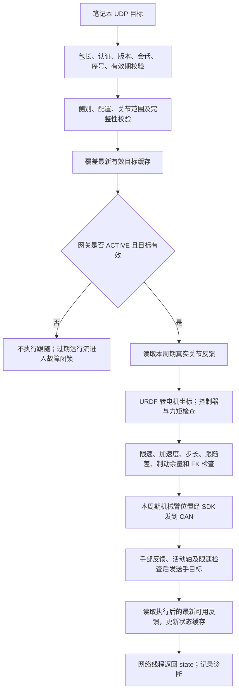

# 机器人收到关节目标后的执行流程

核对日期：2026-09-22。本文描述当前 `robot_link` 真实硬件后端，覆盖单臂、单臂＋同侧手、双臂＋双手。
模拟后端只验证通信和状态流转，不执行真实驱动的全部检查。协议字段见 [PROTOCOL.md](PROTOCOL.md)，启动方法见 [README.md](README.md)。

## 目录

- [1. 从收到目标到实际动作](#1-从收到目标到实际动作)
- [2. 收包校验与最新目标缓存](#2-收包校验与最新目标缓存)
- [3. 状态决定是否允许执行](#3-状态决定是否允许执行)
- [4. 每个控制周期如何运行](#4-每个控制周期如何运行)
- [5. 机械臂目标如何变成本周期指令](#5-机械臂目标如何变成本周期指令)
- [6. 灵巧手目标如何执行](#6-灵巧手目标如何执行)
- [7. 反馈返回与日志含义](#7-反馈返回与日志含义)
- [8. 异常停止和恢复](#8-异常停止和恢复)
- [9. 频率和超时不是同一个概念](#9-频率和超时不是同一个概念)
- [10. 代码入口索引](#10-代码入口索引)

## 1. 从收到目标到实际动作

笔记本已完成 PICO/SenseGlove 输入处理、重定向和 IK。机器人收到的是期望关节位置，
机器人端不重新求人体 IK，也不把目标数组直接原样送到电机。



三个位置量必须区分：

| 量 | 来源 | 含义 |
| --- | --- | --- |
| 期望目标 | 笔记本 `arm_urdf_rad` | 希望逐渐跟踪到的位置 |
| 本周期命令 | 机器人 `CommandTrajectory` | 结合上一命令、实际反馈和限制计算出的下一步位置 |
| 实测反馈 | 控制器 CAN/手部反馈 | 硬件当前报告的位置，可能落后于命令 |

例如目标从 0° 变成 30°，本周期并不直接下发 30°。轨迹器根据实测反馈时间间隔和限制生成一个小步，
后续周期继续接近最新目标。若人体目标中途改变，下周期跟踪新目标，不排队走完旧目标。

## 2. 收包校验与最新目标缓存

`Gateway.network_loop()` 运行在独立网络线程；它不直接调用电机运动接口。

接收一包后依次检查：

1. 包大小不超过 8192 bytes；JSON、HMAC-SHA256 认证和版本合法。
2. 来源 IP/端口和 `session` 属于当前控制会话。
3. `seq` 是严格递增整数，重复包和乱序包拒绝。
4. `lease` 是机器人最近签发的令牌，仍处在 200 ms 有效期内。
5. `side`、`contract_id` 与机器人配置合同一致。
6. 臂目标为七个有限数值且在已配置限位内；手目标为十个 0–255 整数。
7. 双侧模式必须同时包含左右两组臂/手；其中任何一项不合法则整包拒绝。

通过后，`SessionGate.accept()` 一次性更新 `target`、`accepted_seq` 及截止时间。
**只有一个最新目标槽位，没有等待执行的历史目标队列。** 网络线程更新缓存时使用锁，执行线程取出完整的一帧；
执行过程中再收到的新帧留给下一周期，不会把一帧左臂和另一帧右臂临时拼接。

截止时间采用“令牌签发时间＋200 ms”，不采用“收包时间＋200 ms”。例如令牌签发后 60 ms 才收到指令，
该指令只剩 140 ms 有效时间。两机无需通过墙上时钟同步来判断这项有效期。

非法包只增加拒绝计数，不覆盖已有有效目标，也不续有效期。已有有效目标尚未到期时，ACTIVE 仍可继续向它推进；
到期则闭锁停止。因此“拒绝了一包”和“机械臂立即停止”不是同一事件。网络线程在接纳后来包之前也会检查旧流是否已过期，
防止断流后被一个迟到包直接恢复运动。

## 3. 状态决定是否允许执行

| 状态 | 新目标可以进入缓存吗 | 机器人行为 |
| --- | --- | --- |
| `IDLE` | 可以 | 只读反馈，不发送遥操作跟随目标，等待本机 `e` |
| `RETURNING` | 可以，但不用于回零 | 单侧按本地已检查路径回零并张开灵巧手；目标流不驱动此过程 |
| `CALIBRATING` | 可以 | 机器人保持零位失能，等待笔记本确认 PICO 抬臂和自然张手姿态 |
| `ARMING` | 可以 | 正在执行本机保持姿态使能；需要持续有效目标流，尚未跟随人体 |
| `ACTIVE` | 可以 | 按本地周期执行最新有效目标 |
| `FAULT` | 可以，但不解除闭锁 | 不执行目标；重连或新目标都不能恢复跟随 |

`e` 需要本机终端明确输入并回车。单臂真实后端先执行受检回零并确认七轴失能；带手模式再按限速轨迹回到独立反馈标定的自然张开位。网关随后保持 `CALIBRATING`，直到笔记本检测到操作者前臂抬在胸前、肘部自然弯曲且双手自然张开，并发来零位匹配首帧。真实后端此时再次确认七轴反馈、失能状态、控制器状态、手部开位，以及首目标与实测臂位置逐轴相差不超过 1.5°，才允许进入 `ARMING`。上电静默、无法读取反馈时不会盲目使能。真实双臂后端缺少双臂互碰扫掠检查，因此在产生运动前拒绝自动准备。

机械臂驱动随后检查启动姿态几何、配置并核验控制器碰撞等级、预载实测姿态、使能和确认状态，
以保持姿态采集力矩基线，再初始化命令轨迹。当前基线先等待 1 秒，再要求 15 次有效采样，采样超时为 4 秒。
基线是回零后保持姿态的测量参考。网关再使用原配置速度；首个正常跟随周期仍保持初始化位置。

双侧模式先检查两侧首目标和反馈，再依次使能左臂、右臂；第二臂准备期间通过取消/监测回调检查先使能侧的反馈、
控制器和力矩状态。两臂都准备好才开放双手发送。任一步失败执行双侧中止，不能留下另一臂继续跟随。

笔记本接入示例在 IDLE/ARMING 发送实测保持目标，ACTIVE 后才切换为人体求解目标。
网关不使用 ARMING 缓存目标实时引导人体跟随；切换 ACTIVE 后会取缓存中的最新目标，因此调用方应遵守该约定。

## 4. 每个控制周期如何运行

`Gateway.run()` 在主执行线程调用 `tick()`，以 20 ms 为目标周期。网络线程继续收包和返回缓存状态；
硬件操作在执行线程中串行进行。

每个 `tick()`：

1. 检查运行目标是否到期，读取待处理的停止及本机操作。
2. 有停止请求时先请求电子停止；有 `d/e/z` 时处理对应操作。
3. 只有仍为 ACTIVE 才调用后端 `step()`。
4. 再调用 `snapshot()` 读取最新可用反馈，更新网络状态缓存。
5. 执行线程按约 5 Hz 或状态变化记录 JSONL；扣除本周期耗时后等待剩余时间。

单侧真实 `step()` 的顺序为：刷新七轴反馈 → 检查取消 → 计算并发送机械臂命令 → 若带手，检查并发送手目标。

双侧真实 `step()` 的顺序为：

```text
刷新左臂反馈
刷新右臂反馈
确认双手反馈新鲜
计算并发送左臂本周期目标
计算并发送右臂本周期目标
再次检查取消/有效期
一次限频检查后整包发送双手目标
```

两臂各自的完整控制器/力矩/轨迹检查在该臂发送函数内执行。虽然两侧反馈先读取，仍可能左臂已经发送后，
右臂在轨迹计算或 CAN 发送时失败。此时无法回滚左臂已发命令，会立即请求两臂停止并冻结手部新目标。
**整包校验是网络目标接纳的一致性，不是四个硬件的原子事务或硬件同步。**

读取反馈可能经过原驱动的短暂反馈恢复逻辑；若最终没有有效反馈，就不生成该周期新目标。
在目标有效期内，同一个目标可用于多个新鲜反馈周期继续推进；如果两个控制周期之间收到多包，则只使用最后一包。

## 5. 机械臂目标如何变成本周期指令

核心链路：`HardwareBackend.send_arm()` → `NeroSingleArmDriver.command_full_urdf()` →
`_command_trajectory_full_urdf()` → `CommandTrajectory.propose()` → SDK。

### 5.1 坐标转换

单臂适配器将七轴目标放入 14 维内部数组的对应侧，另一侧占位为零。底层只选出当前侧发送，
**不会因此命令另一机械臂回零**。双侧由两个独立单臂驱动各自处理自己的数组。

使用配置方向和偏置：

```text
q_physical = direction * q_urdf + offset
q_urdf     = (q_physical - offset) / direction
```

限位和轨迹运算使用电机/SDK 物理坐标；网络目标和返回的臂位置使用 URDF 弧度。
电机偏置只在机器人侧应用一次，笔记本不能提前重复加偏置。

### 5.2 下发前检查

- 本地已使能、无驱动闭锁原因；控制器/七轴驱动状态及运动模式符合要求。
- 力矩相对使能保持基线没有持续超限；当前配置需连续 5 次检查超限才触发该项故障。
- 七轴实测值、时间戳、硬限位及配置运动范围有效。
- 网络目标映射到物理坐标后再次检查范围；超出配置范围不通过分别裁剪各轴来强行执行。
- 控制周期反馈快照在发送前及轨迹计算后检查是否超过 100 ms。

### 5.3 轨迹计算

轨迹器保留上一次**已提交命令**的位置、速度和反馈时间戳。时间步长来自反馈时间戳差值，
不是无条件写死 0.02 秒：相同时间戳跳过生成新命令；倒退或超过 `command_trajectory_max_dt_s` 则拒绝。

计算中同时约束：

| 约束 | 作用 |
| --- | --- |
| 关节位置范围 | 本周期命令必须在已配置运动范围内 |
| 最大速度 | 限制每轴运动速度 |
| 最大加速度 | 从上次命令速度平滑改变，转向时也受约束 |
| 单步增量 | 限制每次有效反馈更新对应的最大位置步长 |
| 命令相对反馈超前量 | 防止目标不断向前推，而实体机械臂尚未跟上 |
| 制动余量 | 留出在限位/超前边界前减速的空间；不足时尝试受限减速 |
| 肘部协调 | J3 目标与反馈相差超过 10° 时，暂缓进一步增大物理 J4 弯曲目标 |
| FK 端点速度 | 使用正运动学检查肘/腕位置变化，必要时降低本周期推进量 |

如果在这些限制下找不到可行下一步，则产生轨迹故障，而不是强行发目标。
接近反馈超前边界时会监测实测关节是否向目标取得进展；当前配置无有效进展持续约 2 秒会报告
`persistent feedback lead`。它不是简单“人体目标离得远”，而是命令已接近允许超前量且实体跟进不足。

当前 YAML 的主要设置（修改配置后以合同和实际加载值为准）：

| 项目 | 当前值 |
| --- | --- |
| 左右臂关节速度上限 J1–J7 | 约 `[26,26,24,30,24,24,24]` °/s |
| 左右臂加速度上限 J1–J7 | 约 `[40,40,45,50,50,50,50]` °/s² |
| 单步上限 J1–J7 | 约 `[2.8,2.8,2.5,2.5,2.5,2.5,2.5]` ° |
| 相对反馈超前量 J1–J7 | `[3,3,3,3,1.5,1.5,1.5]` ° |
| 肘/腕命令端点速度上限 | 0.22 m/s |
| 控制器速度百分比 | 30；与上述主机轨迹速度限制是不同层参数 |
| 实时 MOVE_J 背压/单途经点门禁 | 两侧均关闭，当前使用连续有界 MOVE_J 目标流 |

### 5.4 碰撞检查的实际范围

当前 `torso_collision_enabled=true`，`teleop_torso_collision_enabled=false`：

- 启动姿态检查和单侧安全回零使用躯干几何保护。
- 配置的普通臂／躯干包络间隙为左臂 30 mm、右臂 29 mm；右臂仅比原配置降低 1 mm。右臂调整来自现场确认无实际接触后的模型预检与离线路径验证，回零时仍逐段检查完整路径。安装处 `link2/waist3` 保留独立的 5 mm 结构间隙配置。
- 实时跟随没有逐周期躯干几何检查；关节范围、力矩、反馈跟随差、FK 端点速度等限制继续执行。
- FK 速度限制不等于碰撞检测；双臂之间没有完整互撞保护。

### 5.5 实际下发与轨迹提交

当前左右臂 `tracking_control_mode=j`，调用 `NeroArm.move_j()`，再由厂家 SDK 编码为 CAN 帧。
左臂使用 V112，右臂使用配置的 DEFAULT 协议；左臂路径保留模式帧在位置帧之前发送的现有处理。
只有显式配置 CPV 时才走备用 `move_tracking_positions()` 分支。

对于需要发送位置帧的步骤，SDK 调用成功返回后才提交本周期轨迹状态；失败不能把未发送步骤当作已执行。
重复反馈等正常跳过不一定产生 CAN 位置帧。启用可选背压时，相同量化位置也可能只推进诊断/轨迹状态，不重复下发。
SDK 返回成功说明发送调用成功，不证明机械臂已经到位；真实位置仍须看 CAN 反馈。

机器人主机实现的是反馈约束的位置指令生成和监督，不在此 Python 代码中实现电机电流/力矩内环。

## 6. 灵巧手目标如何执行

网络 `hand_unit` 已是笔记本映射后的 L10 物理十轴整数，机器人不再执行人体手指弧度到 0–255 的重定向。

单侧使用 `command_physical()`，双侧使用 `command_physical_batch()`。后者先校验两手，
在同一把反馈锁和同一次发布频率判断内处理两手，避免左手发完后右手被限频跳过。

处理顺序：

1. 检查活动侧、十轴长度、有限数值和输出范围。
2. 确认手部发送已开启、所有活动手反馈新鲜；否则关闭继续发送并返回失败。
3. 检查 `publish_hz=50` 的发送间隔；间隔未到直接返回成功但不发送。
4. 未开放轴的目标替换为当前反馈，再进入步长/速度限制；不采用笔记本请求的未开放轴动作。
5. 以最近手命令为基准限制每帧增量，取整并发送。当前 `max_step=18`，
   `max_velocity=400`、`publish_hz=50`，速度项对应每次最多 8 个单位，故通常受更小的 8 限制。
6. 通过本机 loopback UDP 15051 交给 `hand_ros_bridge.py`，后者分别发布
   `/cb_left_hand_control_cmd`、`/cb_right_hand_control_cmd`，底层 LinkerHand SDK 再发送 CAN。

手反馈由 ROS 主题经本机桥返回共享接收器。网络侧双手整包发送，但本机桥仍逐侧发布，硬件并非同时响应。
这里的限速按配置发布间隔计算；程序变慢不会补发积压帧来“追赶”。
手部没有复用机械臂的七轴速度/加速度轨迹器，也不应把手发送成功当作物理到位确认。

## 7. 反馈返回与日志含义

执行周期最后 `snapshot()` 再读取最新可用反馈；这不是等待该命令执行完毕，也不保证这次读到的是新采样。
双侧反馈按 `feedback.sides.left/right` 返回，先读取侧累加等待另一侧读取所消耗的时间。
网络线程约 50 Hz 返回缓存状态，不直接额外读取 CAN。

| 字段/记录 | 可以说明什么 | 不能说明什么 |
| --- | --- | --- |
| `accepted_seq` | 最近整包目标通过协议校验 | 对应目标已下发、已到位 |
| `feedback.arm_urdf_rad` | 最近可用的实测位置 | 这是笔记本目标或轨迹器命令 |
| `arm_feedback_age_s` + `feedback_cache_age_s` | 采样年龄与缓存等待时间 | 未包含精确跨机网络延迟 |
| `feedback.enable_states` | 七轴新鲜使能状态，未知为 null | 仅凭网关 ACTIVE 就确认全部硬件正常 |
| `stop_send_returned` | 停止调用是否返回 | 停稳或失能已被反馈确认 |
| 网关日志 `target` | 记录时最新接纳的网络目标 | 该周期实际发送给电机的中间目标 |

臂驱动内部的 `trajectory_diagnostics` 还区分 `ik_urdf_rad`（沿用原字段名，网关下是网络目标）、
`trajectory_urdf_rad`、`feedback_urdf_rad`、`position_frame_sent` 和速度限制状态。
**当前 `state` 和网关 JSONL 并未完整导出这些逐周期轨迹字段，也没有 executed_seq/到位 ACK。**
不能仅凭网关日志目标推断电机收到的每一帧位置。默认 JSONL 为约 5 Hz 状态快照加状态变化记录，不是 50 Hz 全量 CAN 记录。

## 8. 异常停止和恢复

| 情况 | 当前处理 |
| --- | --- |
| 无效/乱序/越界网络包 | 拒绝包，保留尚未到期的旧目标；不续有效期 |
| ACTIVE/ARMING 目标过期 | 置取消事件、进入 FAULT，安排执行线程发送电子停止 |
| 实测反馈失效、力矩/控制器/轨迹异常 | 拒绝继续生成/发送目标，进入故障路径 |
| 双侧中任一臂或手执行失败 | 双侧后端立即取消并尝试停止两臂；网关随后维持 FAULT |
| 本机 `s/x` 或网络 `stop` | 请求电子停止并闭锁；不自动回零 |
| 本机 `d` | 请求失能，记录确认结果；可能失去支撑，不是回零 |
| 本机 `q` / Ctrl+C / SIGTERM | 请求停止并退出，不隐式回零 |
| 单侧 `z` | 独立检查、避碰规划、逐段回零及失能；成功后才回 IDLE |
| 故障后 `r` | 仅灵巧手核验七轴失能、控制器状态和手部反馈，不发送回零目标；单臂执行原 `z` 受检回零；双臂拒绝 |
| 双侧 `z` | 明确拒绝，不发送回程；缺少完整对侧臂/手扫掠检查 |

双侧 stop/disable 对两臂分别尝试，一侧 CAN 异常不跳过另一侧。手部冻结指的是不再发新目标，
不是手指硬件瞬间停止；控制器仍可能继续执行之前已收到的目标。

网络线程只置取消事件，不并发发送 CAN。若执行线程正阻塞于 SDK/反馈恢复/日志写入，停止发送需要等待它返回。
双侧调用之间也存在时间差；断流保护不能视为硬实时急停或物理急停替代。
故障后新目标或重连都不能解除闭锁。仅灵巧手可用 `r` 核验失能和反馈后恢复；单臂按原排障并使用 `r`/`z` 受检回零；双侧需现场流程，不能拼接单臂回零绕过对侧障碍。

## 9. 频率和超时不是同一个概念

| 时间项 | 当前值/含义 |
| --- | --- |
| 网关执行周期 | 目标 20 ms；执行超时则实际频率降低 |
| 网络 state 周期 | 目标约 20 ms；含调度及收包等待，不保证与执行同步 |
| 网络目标令牌 | 从签发起最多 200 ms，包含网络往返消耗；不是 200 ms 控制周期 |
| 七轴轨迹反馈间隔 | 正增量不超过 100 ms；重复反馈跳过 |
| 短暂反馈恢复等待 | 配置上限 300 ms，期间网络看门狗仍可置取消事件 |
| 控制器/驱动状态新鲜度 | 300 ms |
| 手部普通执行反馈新鲜度 | 500 ms；手部几何反馈和笔记本示例还有各自更严格门槛 |

一个 20 ms 网关周期可能不产生新的硬件位置帧；例如反馈重复、手部发布间隔未到。
反过来，收到一个有效目标也可能在有效期内执行多次小步。需要分别测量输入生成、网络接收、控制循环和实际硬件发送，
不能仅凭 `publish_hz=50` 或 `accepted_seq` 增长声称整个机器人稳定运行于 50 Hz。

## 10. 代码入口索引

| 路径 | 关键入口 |
| --- | --- |
| [protocol.py](esrobo_link/protocol.py) | `unpack`、`validate_target`：包认证、字段和限位校验 |
| [session.py](esrobo_link/session.py) | `accept`、`fresh`：整包接纳、最新目标和有效期 |
| [gateway.py](esrobo_link/gateway.py) | `network_loop`、`request`、`tick`、`run`：线程与状态机 |
| [backends.py](esrobo_link/backends.py) | `HardwareBackend`、`DualBackend`：真实单侧/双侧执行顺序 |
| [nero_driver.py](../teleoperation/src/esrobo_teleop/robot/nero_driver.py) | `initialize_command_trajectory`、`_command_trajectory_full_urdf`、`move_j` |
| [command_trajectory.py](../teleoperation/src/esrobo_teleop/robot/command_trajectory.py) | `propose`、`commit`：候选轨迹和提交 |
| [linker_hand_driver.py](../teleoperation/src/esrobo_teleop/robot/linker_hand_driver.py) | `command_physical_batch`、`_apply_safety`、`_send_physical` |
| [hand_ros_bridge.py](../teleoperation/bridges/hand_ros_bridge.py) | `spin_once`、`_send_feedback`：本机手部命令与反馈桥 |
| [teleop_config.yaml](../teleoperation/config/teleop_config.yaml) | 本文列出的实际默认部署参数 |
