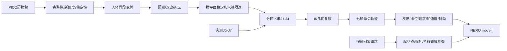

# ESROBO 遥操作当前运行逻辑

> 最近核对日期：2026-09-21
> 当前重点入口：PICO 右臂单臂遥操作
> 代码范围：当前工作区，不代表某个已经提交的 Git 版本

本文档记录**当前代码实际执行的逻辑**，用于持续跟进程序现在如何启动、计算、检查、下发、停止和回零。

- 历史修改及其原因记录在 [`TELEOPERATION_CHANGELOG.md`](TELEOPERATION_CHANGELOG.md)。
- 实机启动步骤和现场操作记录在 [`TELEOPERATION_RUNBOOK.md`](TELEOPERATION_RUNBOOK.md)。
- 本文档不保存某次测试结束时的瞬时机械臂姿态，也不按时间追加旧实现。运行逻辑改变时直接更新对应章节；历史差异另写入 changelog。
- 运行中的 Python 进程不会热加载工作区修改。代码或配置更新后，必须按安全流程退出并重新启动，才能使用新逻辑。

## 最新补充：V112 CPV 的 SocketCAN 发送节奏（当前为备用路径）

左臂 CPV 的一个七轴目标不是七个 CAN 帧。厂家 V112 SDK 会在每个关节位置前重复 CPV 模式帧，并可能把该关节第一次位置帧发送两次。程序因此执行以下发送约束：

1. 未显式指定超时的 SocketCAN 写入最多等待 20 ms，等待健康总线的短时发送队列排空；超时仍按传输故障停止。
2. 七轴 CPV 批次在六个关节边界各等待 2 ms，准备保持、模式确认保持和实时跟随使用同一发送函数。
3. 不通过增大 `txqueuelen` 掩盖发送突发，避免机械臂延迟执行积压的旧目标。
4. 当前左臂配置使用 MOVE_J；这些约束只在显式启用 CPV 诊断路径时生效。

## 1. 当前适用范围

左右单臂入口共用 `TeleopNode`、位置 IK、命令轨迹和回零实现；左臂已同步 J4 的 −8°～120°范围。速度、加速度、命令领先、屈肘目标限幅和跟随期碰撞策略一致。J3 委托范围、安装变换、CAN 通道和固件协议保持各侧配置，不能直接互换。

右臂入口为 [`scripts/run_pico_right_arm_teleop.sh`](scripts/run_pico_right_arm_teleop.sh)，它复用左右共用启动器并固定传入：

```text
--arm-only --arm-side right
```

纯右臂模式的输入和控制范围如下。

| 对象 | 当前处理 |
|---|---|
| PICO 右肩、右肘、右腕位置 | 生成右臂 J1-J4 目标 |
| 右臂 J5-J7 | 每周期保持最新实测反馈，不使用 PICO 腕部方向 |
| SenseGlove | 不启动、不要求标定 |
| 右侧 LinkerHand | 不初始化、不控制 |
| 左机械臂和左手 | 不连接、不发送命令 |

纯右臂碰撞模型仍包含机械臂、腕部、力传感器和刚性手掌。活动手指只在 arm+hand 联动入口中纳入碰撞包络。

## 2. 总体数据流



控制循环使用 `ik.dt=0.02 s`，理论频率为 50 Hz。实际命令推进以新的机械臂反馈时间戳为准；重复或不完整反馈不会推进轨迹。

## 3. 启动器和连接流程

### 3.1 启动器顺序

[`scripts/run_pico_left_arm_teleop.sh`](scripts/run_pico_left_arm_teleop.sh) 是左右共用启动器，右臂入口按以下顺序执行：

1. 启动并检查 XRoboToolkit PC Service。
2. 最多等待 20 秒，确认 PICO 右肩、右肘、右腕数据完整。
3. 启动 PICO UDP 桥和骨架网页预览。
4. 配置右臂 `can_piper2` 为 1 Mbps，并要求接口进入 `ERROR-ACTIVE`。
5. 操作者按一次 Enter，进入自然下垂标定流程。
6. 标定完成后，程序等待单键 `e`，不会自动使能或运动机械臂。

启动脚本进入标定前的 Enter 是明确的人工确认。标定完成后的使能和启动对齐不再调用同步 `input()`，按一次 `e` 即可进入后台检查流程。

### 3.2 右臂通信和控制模式

当前配置：

```text
CAN                 can_piper2
固件反馈解析         DEFAULT
CAN bitrate          1000000
位置命令             move_j / command_mode=j
move_js              默认禁止
controller speed     30%
```

连接时程序请求控制器打开 CAN 主动反馈，然后确认七个关节全部失能。请求反馈本身不发送位置目标，也不使能电机。

左臂 V1.12 有时上电后不发布完整状态。程序只允许一次受限的自然下垂零位反馈唤醒；如果唤醒后
仍缺少完整七轴角度或七轴使能位，启动失败记录 `power_cycle_required=true`，节点进入
`POWER-CYCLE REQUIRED` 状态。该状态锁住后续 `e/z` 和位置回零；`q` 或 Ctrl+C 只请求电子
急停并结束进程，不发送位置。若反馈完整但姿态、限位或使能结果不合格，仍按对应门禁失败处理，
不会仅凭启动失败推断必须重新上电。

### 3.3 URDF 与 SDK 物理角度映射

两侧当前都使用：

```text
physical = direction * URDF + offset
direction = [+1, +1, +1, +1, +1, +1, +1]
offset    = [0, pi/2, 0, 0, 0, 0, 0]
```

因此右臂 URDF 七轴零位对应 SDK 物理位置：

```text
[0 deg, 90 deg, 0 deg, 0 deg, 0 deg, 0 deg, 0 deg]
```

日志中的 URDF 角度和 SDK 物理角度不能直接混用，尤其是 J2 相差 90°。

## 4. PICO 标定和按 `e` 的检查

### 4.1 正式标定

人体自然下垂标定用于建立固定的人体到机器人参考：

- 进入标定前提供 5 秒准备时间；
- 标定阶段总时长约 4 秒，其中前 1 秒不采样；
- 肩、肘、腕位置最大标准差不得超过 0.05 m；
- 肘部允许自然微屈，不要求用力伸直；
- 只有初次标定或显式按 `r` 才会改变正式参考。

### 4.2 按 `e` 时的最新人体目标

按 `e` 后先提供 5 秒姿态准备时间，再检查最近 0.5 秒数据：

- 最新数据年龄不得超过 0.5 秒；
- 至少 5 个完整肩、肘、腕样本；
- 最大位置标准差不得超过 0.05 m；
- 骨段方向和肘角必须有效。

当前人体姿态相对标定姿态的大臂方向差、小臂方向差和肘角差只记录诊断，不再拒绝使能。正式自然下垂参考不会被这次最新目标覆盖。

### 4.3 机器人启动零位

程序读取实测关节并计算相对 URDF 零位误差：

- 七轴误差都不超过 8°：认为启动零位已满足；
- 任一轴超过 8°：登记为“需要启动对齐”，不立即运动；
- PICO 标定完成并按 `e` 后，才在后台执行安全回零；
- 回零完成并确认失能后，再次核验最新 PICO 人体目标，然后进入正常使能。

## 5. 正常使能流程

在不需要启动回零或启动回零已经完成后，按以下顺序使能：

1. 获取新鲜、完整、在硬限位内的七轴反馈。
2. 检查实测姿态是否通过当前姿态碰撞检查。
3. 读取控制器和七个驱动器状态。
4. 确认七轴失能后设置并回读控制器碰撞等级。
5. 将当前实测姿态作为预装保持目标；失能期发送可能被忽略，不能据此保证控制器已替换旧目标。
   确认七轴使能后、首次保持目标前重新提交运动模式；使能边界的实体行为仍需现场验证。
6. 请求使能，并要求七个关节使能位全部为真。
7. 继续保持当前姿态 1 秒。
8. 采集 15 个完整力矩样本，以中值建立本次会话基线。
9. 再次检查 PICO 最新稳定目标。
10. 使用使能后的实测关节重新建立机器人参考姿态。
11. 初始化笛卡尔弯曲角可观测性基线、J4 初值参考、方向滤波和命令轨迹。
12. 第一条成功跟随命令仍保持当前实测位置；后续新反馈到达后才逐步接近人体目标。

任一步失败都不会跳过检查继续下发跟随目标。

第 3 步读到 `arm_status=1` 时，按 `EMERGENCY_STOP` 拒绝，并记录
`startup_refused`（失败阶段 `controller_preflight`）及只读控制器快照；该尝试尚未发送使能
或位置命令。七轴失能与急停清除是不同条件，重启进程不会复位控制器。对于跨进程保留的急停，
程序只在急停是唯一控制器状态、CAN 模式、七轴完整失能、驱动无其他故障、反馈/硬限位/当前
碰撞检查全部通过时登记恢复资格；仍需操作者显式按 `z` 或故障闭锁下按 `q`。恢复线程复位前
再次检查全部条件，复位后验证控制器正常、七轴仍失能且姿态变化不超过 0.2°，才进入原受检回零。
本进程由操作者按 `x` 产生的急停不会取得该资格。

纯 PICO 单臂模式的每次 `e` 都由后台使能线程执行，使耗时的启动对齐不会占用按键监听。该线程从
最新目标检查到最终实测参考、IK 会话和命令轨迹初始化完成期间，与主控制循环共用同一个状态锁。
主循环从取重定向目标、读取反馈，到 IK/IMU 补偿、故障判定、发送和 FK 诊断，完整周期持有这把锁。
单独给 `advance/solve` 加锁不够：旧周期的局部目标和反馈可能跨越整次初始化，在线程结束后被误用。
使能线程等待在途周期完成；主循环在启动线程存活时暂停计算，在锁内也复检，发现新排队的使能请求时
在下次求解前丢弃该预览周期并让出锁。周期末常规休眠位于锁外。这样 `_prev_targets`、J3/J4 基准、
方向滤波、机器人参考以及本周期目标/反馈属于同一次会话。PICO 接收线程仍继续收集最新人体数据，
`s/q/x/d` 仍可取消或停止使能流程。

## 6. PICO 骨段到机器人目标的映射

### 6.1 相对骨段方向模式

当前 `retargeting_mode=arm_vector`，位置模式为 `segment_direction_relative`：

1. 从 PICO 肩、肘、腕计算人体大臂和小臂方向。
2. 用最小旋转把标定人体大臂方向对齐到机器人参考大臂方向。
3. 同一个旋转同时作用于人体大臂和小臂。
4. 映射后的方向分别缩放到 URDF 中的机器人真实大臂和小臂长度。
5. 机器人肩点固定，依次生成机器人肘点和腕点目标。

网页中的“PICO 原始骨架”和“重定向目标”不在同一个尺寸与坐标定义中，不能要求点坐标直接重合。正确比较项目是：大臂方向、小臂方向、肘部夹角和动作变化趋势。若这些方向或角度也明显相反或长期偏离，则属于重定向异常。

### 6.2 肘角映射

当前模式为 `direct_absolute`：

- 标定姿态只用于坐标方向对齐，不作为肘角零点；
- 每帧直接计算 PICO 上臂与小臂的夹角，作为机器人目标骨段肘角；
- 即使当前肘角小于标定肘角，也不会把结果裁为机器人近直臂角度；
- `responsive_absolute`、`smooth_absolute` 和 `relative` 仍可显式配置，用于旧行为对比。

使能时不会把正式标定姿态预填到方向滤波器。第一个实时目标来自使能时最新稳定人体姿态，随后仍由末端平移限速从实测机器人姿态逐步接近。

### 6.3 近直臂弯曲平面

肩、肘、腕接近共线时，小臂绕大臂轴线的旋转平面不可可靠观测。当前映射与 IK 使用同一组实际肘角门限：

- 实际目标肘角不超过 4°：采用校准机器人小臂平面；
- 4°到 10°：smoothstep 平滑混合；
- 超过 10°：采用 PICO 实时弯曲平面。

门限在三处按实际目标保持一致：

1. 原始肘角映射之后；
2. 大臂、小臂分别滤波和死区处理之后；
3. 末端平移限速先固定完整稳定目标，再对本周期选定的连续几何状态复核；不再在二分搜索的每个候选中改变弯曲平面。

### 6.4 预测、滤波和末端限速

```text
预测时域                         0.03 s
速度估计回看                     0.05 s
单次最大预测位移                 0.03 m
预测开始速度                     0.06 m/s
预测完全启用速度                 0.25 m/s
方向低通截止频率                 3-8 Hz
速度调节系数                     0.7
大臂方向死区                     0.25 deg
小臂方向死区                     0.30 deg
肘点/腕点最大平移速度            0.22 m/s
```

末端限速先固定本周期的完整目标，再把状态分成大臂方向、肘角和弯曲平面，按方向弧长计算初始推进量并恢复真实大臂、小臂长度。重建后的肘点或腕点若超过本周期允许位移，只向上一条已知安全状态回退；不依赖“候选位移随插值进度全局单调”的假设。每周期仍同时限制肘点和腕点，任何一处不得超过 0.22 m/s。

配置中存在 `arm_vector_max_reach=0.72`，但当前实现没有引用该字段，不能把它视为已生效限制。

## 7. 右臂分区 IK

### 7.1 关节职责

当前单臂入口同时开启 `partition_terminal_wrist_ik=true` 和 `enable_elbow_tasks=true`，使用实际 URDF 的有界位置最小二乘求解，不再锁定几何近似 J4 后运行 Pink。

| 关节 | 当前求解方式 |
|---|---|
| J1、J2、J4 | 联合拟合目标肘点、手基座位置 |
| J3 | 近直臂时在求解内部固定；可观测后加入同一次联合求解 |
| J5-J7 | 作为硬约束；纯 PICO 模式取本周期实测值 |
| 对侧机械臂 | 保持实测值 |
| 腰部、头部 | 使用固定零位模型 |

位置边界直接使用驱动器有效物理限位经过方向、偏移转换后的 URDF 区间，再与 URDF 本身限位取交集。求解时使用这些边界，不在求解完成后单独裁剪 J3/J4。

### 7.2 为什么不能把骨段夹角直接当成 J4

当前腕点任务帧是 `Hand_link`，位于 J5-J7 之后。肩—肘—手基座形成的无符号夹角同时受腕部偏置影响，不能直接等同于有符号 J4；近直臂、J4 略为负角时尤其容易出现错误分支。

之前固定会话参考的公式能消除追逐反馈的漂移，但仍不能保证肘点和腕点同时正确。现在 J4 始终参与实际 URDF 位置求解。`partition_elbow_flexion_from_segments=true` 仅允许用旧几何估计选择初始分支，不再锁定最终角度。

### 7.3 联合求解步骤和设置

1. 使用上一条有效目标作为活动 J1-J4 初值；首次取实测关节。
2. 固定本周期 J5-J7，并检查它们位于有效位置区间。
3. 使用本周期固定的 J5-J7 和有效 J4 上限做 URDF FK，得到该腕姿态下的最大正向屈肘骨段角。请求超过该角度时，保持肘点、小臂长度和弯曲平面，只限制腕点屈肘角，再进行求解。之后按有效骨段的实际弯曲角决定是否固定 J3。
4. 通过 URDF FK 和解析位置雅可比，联合最小化肘点、手基座位置残差。
5. 主初值无法满足原有 30 mm 接受条件且 J3 已可观测时，最多另试两个弯曲平面分支；每个分支仍遵守同一限位。
6. 检查最终两个位置误差，只有通过才保存为下一周期初值。

```text
求解器                           scipy.optimize.least_squares
肘点位置残差权重                 80
手基座位置残差权重               32
每个分支函数求值预算             24
最大分支数                       3（主分支 + 两个备选）
ftol / xtol / gtol               1e-9 / 1e-9 / 1e-9
控制周期                         0.02 s
```

残差向量先分别乘以权重，再做最小二乘。求值次数有上限，不代表操作系统保证硬实时截止时间。新路径不使用 Pink 的速度积分或方向任务；关节速度、加速度和命令领先量仍由后续命令轨迹层负责。

左右臂 J4 当前范围均为 −8°～120°。右臂 SDK 上限 2.146755 rad 减去既有 0.05 rad 余量后约为 120.135°，URDF 上限约为 122.61°，因此 120°位于两者以内。只扩大位置范围，不提高速度或加速度。

屈肘工作范围限幅不是故障：终端输出一次 `TARGET LIMITED`，回到范围内输出恢复提示。日志保留 `requested_positions_m` 和 `effective_positions_m`、请求/有效屈肘角、J4 上限及腕点限幅距离。当前网页的重定向层仍表示限幅前的请求，IK 层表示实际有界求解；两层在限幅时有差异是明确的工作范围限制。该处理仅解决超过 J4 正向屈肘范围的输入，其他不可达目标仍可能被 IK 拒绝。

J1–J4 有界求解如果仍超过 30 mm，不再一律锁止。满足以下全部条件时进入可恢复的关节边界暂停：

1. 最终候选值明确贴住至少一个当前侧软件位置上下限；
2. 对每个贴边关节，实测反馈也已经到达同一边界 `0.25°` 内；
3. 目标、候选值和肘/腕残差均为有限数值。

暂停期间轨迹层以最后控制器命令为起点执行 `brake_only`，按原加速度、速度、反馈领先、位置和末端速度约束减速到零并保持。程序继续接收 PICO、读取反馈和重新求解；肘点与腕点误差都回到 `25 mm` 内并连续通过 3 个新鲜周期后，自动恢复跟随。未实际到边界的不可达目标以及退化输入、数值失败、终端关节越界仍执行安全锁止。

### 7.4 J3 可观测性

门限比较的是**目标笛卡尔骨段的实际弯曲角**，不能用相对本次会话参考的增量或求解出的 J4 代替：

- 实际肘角不超过 4°：J3 固定为上一条有效目标，并从优化变量中移除；J1、J2、J4 仍联合求解。
- 实际肘角超过 4°：J3 加入联合求解，直接匹配重定向器提供的目标。
- 重定向器已经在 4°～10°区间平滑混合弯曲平面，IK 不再对 J3 二次混合，也不在求解后用旋转圆公式覆盖 J3。

### 7.5 IK 最终接受条件

求解结果必须有限，相对**工作范围限幅后的有效目标**，肘点和腕点分别满足：

```text
elbow error <= 0.03 m
wrist error <= 0.03 m
```

任一误差超过 30 mm、固定关节越界、目标骨段退化或求解异常时：

- `last_solution_valid=false`，不更新上一条有效解；
- 返回实测关节作为占位，不下发失败的 IK 候选目标；
- 输出一次 `[ik] solve unavailable`；
- 跟随中的失败把本周期实测关节、重定向目标、误差及求解诊断写入 `pico_startup` 的 `ik_geometry_rejected` 事件，并进入故障闭锁。

正常完成的求解诊断包含 `method=bounded_urdf_positions`、`evaluations`、`attempts`、`j3_frozen`、目标弯曲角及增量、七轴候选值，以及工作范围限幅前后的目标。周期诊断的 `ik_solver` 保存这些字段，`pico_startup` 的 `ik_workspace_limited/recovered` 保存限幅状态切换。输入或求解异常则记录对应原因。之后得到合法数学解时打印 `[ik] solve recovered`，不会自动解除遥操作故障闭锁。

### 7.6 与旧 Pink 路径及轨迹参数的区别

未进入上述单臂位置分区路径的模式仍使用原 Pink 实现。以下配置不用于当前单臂联合位置求解：

- `iterations_per_cycle=3`、方向任务权重、LM damping、task gain、姿态正则：旧 Pink 任务设置。
- `left/right_j3_retarget_gain`、`ik.j3_observability_full_flexion_deg`：旧 Pink 求解后的 J3 修正设置。当前弯曲平面渐变使用重定向器对应配置。
- `max_command_lead=0.50`、`max_joint_position_delta=0.50`、`max_command_step=0`：不用于对完整分区解逐轴裁剪；真正生效的命令领先与限速位于下一节的轨迹层。
- `task_error_tolerance=1e-4`：当前实现没有读取该字段；实际位置接受条件仍为肘点、腕点各 30 mm。

## 8. 关节位置、速度和轨迹限制

### 8.1 正常右臂限制

| 关节 | 单次反馈步长 | 最大速度 | 最大加速度 | 命令领先反馈 | URDF 委托运行范围 |
|---|---:|---:|---:|---:|---:|
| J1 | 2.8° | 26°/s | 40°/s² | 3.0° | -60° 到 +60° |
| J2 | 2.8° | 26°/s | 40°/s² | 3.0° | -75° 到 +7° |
| J3 | 2.5° | 24°/s | 45°/s² | 3.0° | -90° 到 +150° |
| J4 | 2.5° | 30°/s | 50°/s² | 3.0° | -8° 到 +120° |
| J5 | 2.5° | 24°/s | 50°/s² | 1.5° | -60° 到 +60° |
| J6 | 2.5° | 24°/s | 50°/s² | 1.5° | -30° 到 +35° |
| J7 | 2.5° | 24°/s | 50°/s² | 1.5° | -55° 到 +55° |

有效位置区间是“SDK 物理硬限位内缩 0.05 rad”与上表委托运行范围的交集。当前 `synchronize_joint_motion=false`，七轴独立受限，不强制同步完成。

### 8.2 命令轨迹计算

轨迹使用机械臂反馈的真实 `dt`：

```text
vmax_this_cycle = min(configured velocity, step / dt)
velocity range  = previous velocity +/- acceleration * dt
```

同时预留停止距离：

```text
v * dt + v^2 / (2*a) <= remaining distance
```

剩余距离同时考虑委托运行位置边界和“实测反馈 ± 命令领先差”。制动预留冲突时只允许最大减速；连最大减速都无法进入硬包络时触发轨迹故障。

### 8.3 J3/J4 协调

如果目标 J3 与实测 J3 相差超过 10°，且目标仍要求增加 J4 屈肘，轨迹暂时不增加 J4 目标，让 J3 先建立弯曲平面。J4 已有速度仍按配置加速度连续制动，不瞬间清零。

### 8.4 肘点、腕点和碰撞候选

每个候选命令使用独立 FK 检查肘点和腕点速度。完整候选不安全时，依次尝试：

```text
1, 1/2, 1/4, ..., 1/1024, 0
```

正常遥操作跟随只筛选末端速度等轨迹约束，默认不做实时躯干几何检查。慢速回零或显式开启跟随碰撞检查时，还必须通过从实测反馈、上一命令、候选命令到反应及制动位置的联合关节区间检查；没有可行候选则停止。

### 8.5 命令领先反馈

达到领先边界且反馈始终不前进时仍会闭锁，不能通过左右参数同步取消此保护。2026-09-20 左臂日志 `1789916583383616603` 的 62 个跟随样本七轴反馈完全一致，J1 命令领先达到 3°并连续 2.001 秒无进展；该记录本身不能区分控制器不执行、机械受阻和反馈源异常。

J1-J4 允许 3°，J5-J7 允许 1.5°。达到上限 90%且目标仍继续向相同方向推进时，程序启动该关节的“无实测进展”计时。

控制器刚使能后可能延迟接近 2 秒才开始响应。关节处在领先区时，如果实测反馈沿当前命令方向累计前进至少
`min(0.1°, 领先上限的 5%)`，程序会从该反馈点重新计算 2 秒无进展窗口，但不会借此把保持命令推到领先硬包络之外。
反馈不动、反向运动，或连续 2 秒没有达到上述进展量，才触发 `persistent feedback lead`。诊断字段
`lead_watch_feedback_rad`、`lead_progress_from_anchor_rad` 和 `lead_progress_reset` 用于区分“控制器正在追赶”和“实体反馈冻结”。

遥操作中该错误锁住跟随。回零中程序冻结上一条已经认证的命令，不发送更新目标，等待实测反馈追上；等待仍超过 2 秒才退出。

新位置只有在对应 SDK 发送调用成功返回后才提交，发送失败不推进状态。当前左右臂连续模式会在
每个新的有效反馈周期发送受限七轴目标；重复反馈时间戳不会产生新命令。

右臂 legacy/DEFAULT 的实时跟随继续使用 MOVE_J。速度更新在 SDK 中使用 `move_mode=0xFF` 的
`0x151` 专用帧，下一条获准 J 位置会在需要时补发完整 J 模式，再发送
`0x155/0x156/0x157/0x170`。

### 8.6 左臂 V112 的当前 MOVE_J 实时跟随

当前左臂入口参考仓库根目录 README 已在同一实体机械臂上验证的完整七轴 MOVE_J 控制方式。只参考控制接口，控制器速度继续保持项目原有 30%；右臂同样保持 MOVE_J 和 30%。

左臂正常跟随现在采用与右臂相同的连续提交策略：每次取得新的完整七轴反馈后，使用真实反馈时间差计算速度、加速度、单步、反馈领先和末端速度受限目标，然后提交一条完整七轴 MOVE_J。它不再累计 0.5° 途经点，也不等待上一条命令到位；人体目标反向时，软件轨迹先按最大加速度减速，再连续换向。

会话 `1789978430614674814` 已排除 SocketCAN 发送突发：351 次发送全部成功，10 组节流后的厂家 CPV 模式/当前姿态帧也没有 `ENOBUFS`，但控制器始终反馈 `mode_feedback=1 (MOVE_J)`。程序没有发送人体变化目标，并在失败后恢复 J、确认失能。因此 CPV 代码仅作为显式可选诊断路径保留，当前配置不调用它。

左右臂公共连续轨迹门禁：

| 条件 | 程序行为 |
| --- | --- |
| 新的完整反馈到达 | 计算并发送一个通过速度、加速度、单步、领先量和末端速度检查的七轴目标 |
| 反馈短时缺失 | 保持控制器最后目标，不发送新位置；连续两帧新鲜反馈并重新检查后恢复 |
| 命令接近反馈领先边界但反馈同向前进 | 限制命令在领先包络内，并从有效进展点刷新监视窗口 |
| 反馈持续不前进达到 2 秒 | 报告 `persistent feedback lead`，闭锁跟随并请求一次电子急停 |

控制器速度 30% 是 MOVE_J 内部执行速度，软件逐关节速度、加速度、3°/1.5°领先、末端速度、力矩和状态门禁仍独立生效。启动 ARMED 只表示使能和静态门禁通过；是否运动必须以新鲜编码器反馈确认。

当前日志中 `move_j_waypoint_gate=null`、`command_backpressure=null` 表示连续模式已生效；`position_frame_sent=true` 表示本周期 SDK 位置发送已经返回。`command_skip_reason=duplicate_feedback` 只表示没有取得更新的反馈时间戳。首次跟随仍先发送实测保持目标，失败发送不会提交为新的软件轨迹状态。
周期 `pico_elbow` 日志只保存最近八条启动事件的阶段摘要；完整控制器快照仍只在
`pico_startup` 中保存一次，避免闭锁后重复写入相同大对象。

## 9. 反馈检查

静默左臂唤醒期间若原生 CAN 发送返回 `ENOBUFS`/Error 105，表示发送队列已经填满，不能解释为
控制器接收成功。程序将其记录为 `can_transport` 启动失败，锁住 `e/z` 并要求实体急停、检查
控制器供电及 CAN 链路后重新上电。程序不会通过扩大队列或自动重试来掩盖无 ACK；CAN 不可用时
也不能确认软件急停或失能已经送达。

### 9.1 启动反馈

启动时要求同一 SDK 来源提供两份连续完整反馈：

- 七个角度全部有限；
- 时间戳严格增加；
- 两份反馈的任一关节差不得超过 0.05 rad。

### 9.2 运行反馈

- 正常轨迹仍只接受不超过 100 ms 的反馈间隔；较长间隔不会进入速度、加速度或位置命令计算；
- 首次超过 100 ms 时进入短时保持：保留最后控制器目标，不发送任何新位置命令；
- 300 ms 内恢复时要求连续两份完整、递增的新反馈。随后重新检查控制器、力矩、软硬限位、
  命令领先量；默认不做跟随期躯干碰撞检查。仅当 `teleop_torso_collision_enabled=true` 时，
  同时检查实测姿态到最后控制器目标的整段碰撞路径。全部通过后，以原控制器目标和零速度状态重新建立轨迹；
- 超过 300 ms、SDK 时间戳倒退、恢复复核失败或数据格式异常：闭锁跟随；
- 单帧任一关节跳变超过 0.05 rad：拒绝；
- 同一时间戳下 J1-J6 已更新而 J7 尚未更新：视为 SDK 分组更新，保留上一完整快照，不推进命令，也不刷新年龄。

## 10. 控制器和力矩检查

### 10.1 控制器状态

正常运行要求：

```text
反馈年龄 <= 0.3 s
arm_status == 0
err_code == 0
ctrl_mode == 1
J1-J7 driver_enable_status == true
```

七个驱动器不得出现低电压、电机过热、驱动过流、驱动过热、碰撞、驱动错误或堵转标志。

失能回零预检允许 `arm_status` 为 0 或 6，也不要求电机已经使能；过期反馈和其他故障仍会拒绝。

### 10.2 控制器碰撞保护

当前等级：

```text
[4, 4, 4, 4, 5, 5, 5]
```

配置前必须确认七轴全部失能。程序逐轴写入并读取完整数组验证。配置前后实测姿态最大变化不得超过 0.2°；超过该值会拒绝恢复使能。

### 10.3 软件力矩监控

使能后保持 1 秒并采集 15 个样本，以中值为本次会话基线。右臂允许偏差：

```text
[21, 21, 12, 12, 6, 6, 5] Nm
```

同一关节连续 5 个样本超限才触发。力矩反馈超过 0.3 秒没有有效更新也会停止。

当前左臂近端 J1/J2 使用 25 Nm 动态偏差阈值；J3-J7 仍为 `[12,12,6,6,5] Nm`。该调整来自已确认正常跟随时 J2 达到 22.66 Nm、控制器无碰撞和驱动故障的实机记录。右臂近端阈值仍为 21 Nm。

力矩故障只锁住跟随并保留最后控制器目标，不自动回零或失能。

## 11. 躯干碰撞检查

当前按运行阶段区分软件几何检查：

| 阶段 | 是否检查 |
|---|---|
| 正常遥操作跟随、短时反馈恢复 | 默认关闭，不调用躯干碰撞模型 |
| 使能前一次性实测姿态核验 | 保留 |
| 启动对齐、`s/q/z` 慢速回零 | 起点、零位、规划边、执行及制动区间全部保留 |

配置 `robot.torso_collision_enabled=true` 保留模型与回零保护；新增 `robot.teleop_torso_collision_enabled=false` 只关闭跟随期间的软件几何检查。不能通过关闭前者达到同样效果，否则回零会拒绝执行。启动终端打印跟随检查 ON/OFF，周期诊断记录 `torso_collision_check_active`。

正常跟随不会因为软件预测躯干间隙而停止，也不会提前拦截朝躯干运动；控制器自身碰撞保护、软件力矩监测、反馈和轨迹约束仍生效。改变配置后需退出并重新启动程序。

碰撞几何来自当前 URDF 引用的实际 STL：

- 躯干使用网格凸包；
- 活动机械臂、腕部、力传感器和手掌使用网格包围盒；
- 纯单臂模式不加入活动手指；
- arm+hand 模式根据手部反馈和标定建立手指运动包络。

间隙要求：

```text
普通臂/腕/手掌 对 躯干              30 mm
nero_link2 对 waist_link3 安装邻接     5 mm
```

检查覆盖起点和终点形成的完整七轴区间盒，以覆盖 MOVE J 中各轴不同步运动。无法一次证明时拆分变化最大的关节，最多检查 64 个区间；预算内仍不能证明安全则拒绝。

回零执行（以及显式开启的跟随检查）先核验实测反馈到上一条未完成命令，再把实测反馈、上一命令、候选命令和完整制动位置合并成一个关节区间盒。制动位置包含最多 100 ms 反应时间和按当前速度、最大减速度计算的停止距离。分别检查相邻命令段不能覆盖“某轴还在旧反馈、另一轴已追上新目标”的混合姿态，因此必须检查联合区间。

模型当前假定腰部、头部保持 URDF 零位，不覆盖另一条机械臂、线缆、外部环境或 URDF 未建模外壳。模型通过不等于现场安全认证。

## 12. 运行期故障行为

PICO 过期、机械臂反馈异常、IK 几何拒绝、控制器故障、力矩超限、轨迹无可行速度、启用阶段的碰撞路径失败或 SDK 发送失败时：

```text
停止跟随
保留最后控制器目标
不自动发送零位
不自动失能
锁住后续普通使能/回零入口
```

保留最后目标不代表已经停稳：左臂实录显示，停发约 1.70 秒后控制器仍执行了最后目标。
对于跟随期间的 `persistent_feedback_lead`，已使能时额外请求一次电子急停并保持故障闭锁，
不发送新位置、不自动复位/重试。回零保留原有经避碰验证的等待追赶和超时逻辑。
精确故障事件的 `fault_context.controller_stop` 记录发送返回或异常；返回不等于停稳或七轴失能。
发送失败时使用实体急停，后续失能仍需实际反馈确认。

故障发生本身不会自动回零或未经确认掉使能。操作者随后按 `q` 或 `z` 才会进入显式受检恢复；
当前接触、硬件故障、反馈异常或不安全路径仍会拒绝运动。

## 13. 安全回零

### 13.1 目标和规划

回零目标保持为七轴 URDF 零位。规划依次尝试：

1. 当前姿态到零位的完整直接边；
2. 按约 4°关节空间步长拆分的短边直达路径；
3. 有界双向 RRT-Connect。

```text
搜索时间              5 s
最大节点              5000
随机种子              0
局部步长              4 deg
```

起点、终点、每条边和简化后的路径都重新执行完整区间碰撞检查。超时返回 `no certified path within search budget`，不会退回旧固定关节顺序。

规划完成后必须再次取得静止反馈并与规划起点比较，任一轴偏差不得超过 0.2°。失能手臂可能在规划期间受托扶或重力影响缓慢沉降；第一次超差时程序废弃整条旧路径，从重新确认静止且安全的最新姿态自动重规划一次。第二次仍移动、手臂已使能、当前姿态不安全或反馈不新鲜时停止，不执行旧路径。

### 13.2 执行

正常停止先继承已有命令位置和速度做受控制动。确认停稳后，从新鲜实测位置规划。

普通回零途经点限制：

```text
关节速度              [13, 13, 12, 15, 12, 12, 12] deg/s
肘点/腕点速度         0.11 m/s
停稳速度              0.5 deg/s
终点容差              1.5 deg
连续确认              3 帧
单段超时              30 s
```

加速度、单步、反馈领先差和碰撞余量保持正常值。每个途经点停稳并确认后才进入下一段，终点不会绕过轨迹检查跳发精确零位。

### 13.3 显式故障恢复

`z` 用于操作者已经人工排除接触和硬件故障后的独立回零；故障闭锁后按 `q` 执行相同检查，
并只在回零和七轴失能均确认后退出：

1. 检查控制器、七轴使能状态和当前姿态；
2. 当前姿态不安全或无法证明安全时拒绝自动脱困；
3. 检查停稳并规划路径；
4. 失能状态下先以最新实测姿态预装保持目标；
5. 配置并回读碰撞等级；
6. 配置前后姿态变化不得超过 0.2°；
7. 确认七轴使能并建立力矩基线；
8. 执行路径、确认零位、确认七轴失能；
9. 不自动恢复遥操作；`z` 保持程序运行，`q` 成功后结束程序。

若本进程因为 `persistent_feedback_lead` 请求过电子急停，恢复流程在上述步骤前增加受限顺序：

1. 读取完整七轴姿态与使能位，拒绝未知或混合使能状态；
2. 验证当前姿态碰撞几何；已接触或无法证明安全时拒绝自动脱困；
3. 先请求并确认七轴全部失能，再允许复位控制器；
4. 复位后要求控制器处于可验证的失能正常状态，且姿态变化不超过 0.2°；
5. 再进入常规规划、受控使能、力矩基线和逐段回零。

该顺序只适用于程序自己记录的停滞保护电子急停。操作者按 `x`、实体急停或硬件控制器故障
不会进入自动复位分支。

## 14. 按键语义

| 按键 | 当前行为 |
|---|---|
| `e` | 检查并使能遥操作；不会清除已闭锁故障 |
| `s` | 正常状态下启动安全回零；故障闭锁时只报告停止已经生效；回程中按 `s` 会取消回程 |
| `z` | 人工排障后的显式检查回零，不恢复跟随 |
| `d` | 请求七轴失能，不发送回零位置 |
| `x` | 发送电子急停 |
| `q` | 正常或故障闭锁状态下请求受检回零；零位与七轴失能均确认后退出。回程中按 `q` 只登记成功后退出，不取消回程 |
| `r` | 机械臂、跟随和故障闭锁都关闭时重新采集 PICO 正式参考 |

故障闭锁且机械臂仍使能时，先人工排除接触和硬件问题，再按 `q` 请求受检回零退出。检查失败时
程序不会退出；无法安全运动时按 `d`，等待 `OPERATOR DISABLE: DISABLED`，然后按 `q`。
Ctrl-C 不启动故障恢复回零；软件仍认为电机可能使能时会拒绝退出。若 CAN 无反馈导致失能永远
无法确认，安全回零本身也没有成立条件；此时操作者必须持续托稳并使用实体急停，或按 `x` 请求
电子急停后再用 Ctrl+C 结束进程。`x` 会把本进程状态切到急停并允许结束通信，但电子急停发送返回
不构成七轴失能反馈，后续仍需恢复通信并核验控制器状态。

`POWER-CYCLE REQUIRED` 是按键表中 `q` 的特例：由于缺少实测起点，程序不会调用回零规划器，
而是执行上述无位置电子急停退出流程，并要求左臂控制器重新上电。

## 15. 常见日志的准确含义

| 日志 | 含义 |
|---|---|
| `controller collision ratings verified` | 碰撞等级设置和回读成功，不是错误 |
| `Last geometry check: ...` | 最近一次几何检查的诊断，不一定是当前失败原因 |
| `startup collision guard rejected measured pose` | 上层汇总；需要查看具体 geometry reason、对象和间隙 |
| `TARGET PAUSED` | 实测关节已到达与有界 IK 相同的软件边界；受控减速保持，目标连续 3 帧回到 25 mm 内后自动恢复 |
| `IK geometry rejected` | 肘点或腕点误差超过 30 mm，且不满足可恢复关节边界条件；目标没有下发并锁止跟随 |
| `[ik] solve recovered` | 后续数学求解恢复；不会自动解除已有故障闭锁 |
| `last command outside position/feedback-lead envelope` | 上一发送命令已经超出实测反馈允许领先范围 |
| `persistent feedback lead` | 命令领先反馈且对应关节持续没有有效实测进展；左臂反馈等待采用最终制动载荷后的 3 秒窗口，轨迹硬包络仍保留原 2 秒保护 |
| `torque fault remains active` | 当前回零入口发现已有力矩故障或缺少有效运行基线 |
| `arm moved during recovery-enable configuration` | 碰撞等级配置前后任一关节移动超过 0.2° |
| `startup natural-down alignment failed` | 上层结果；真正原因在前一条 `RETURN <stage>: <reason>` |
| `Return inhibited by fault` | 普通回零不能绕过故障闭锁，需要排障后使用 `z` 或直接 `d/x` |

## 16. 日志和定位顺序

左右单臂运行默认产生参考、完整链路和启动事件诊断：

- `pico_reference_<id>.jsonl`：正式参考、最新稳定目标和两者方向/肘角差；
- `pico_startup_<id>.jsonl`：使能阶段、反馈恢复、IK/轨迹故障及工作范围限幅事件；
- `pico_elbow_<id>.jsonl`：PICO、重定向、IK、轨迹、实测反馈及各阶段耗时；其中 `retarget_pipeline` 记录预测输入、映射后、滤波后、平面稳定后和限速后的大臂/小臂方向、各层肘角，以及限速进度、回退次数和肘/腕实际步长；
- `pico_arm_probe_<id>.jsonl` 和 `pico_can_<id>.jsonl`：临时全量控制器缓存与原始 SocketCAN
  诊断，仅在启动前显式设置 `ESROBO_ARM_DIAGNOSTICS=1` 时产生。常规遥操作不要开启，以免持续
  大量写盘影响实时反馈。

排查顺序：

1. 用相同 `<id>` 关联控制周期、启动事件和可选 CAN 日志；参考日志按终端报告的文件名关联。
2. 先确定失败阶段：标定、启动、IK、轨迹、控制器、力矩、碰撞或回零。
3. 网页目标异常时先比较原始 PICO 骨段方向、重定向骨段方向、肘角及时间戳，不以绝对坐标重合为标准。
4. `Last geometry check` 只有在对应失败原因明确是 collision/torso 时才作为根因证据。
5. `candidate_not_sent` 只代表被拒绝候选，不能当成已发送命令。
6. 进程退出不能证明机械臂已经失能，必须以七轴使能反馈为准。

使能确认、参考检查完成和轨迹故障事件现在附带 `controller_snapshot`、`configured_firmware` 和 `sdk_driver_class`。快照包含控制模式、运动模式、状态码、七轴驱动使能、缓存电机位置/速度以及关节分组时间戳；它不发送 CAN 请求。快照非原子，字段带原时间戳，不能把故障后失能状态倒推为故障发生时的状态。

共用 NeroArm 关闭 SDK 逐帧自动模式设置，启动预载或切换时显式选择模式；连续 `move_j()`
只发四帧七轴位置，不再每周期附带 `0x151`。使能、失能（包括应急失能）、重连、复位和急停
使本地模式选择失效。正常启动确认七轴使能后，首次保持目标之前重新发送一次模式帧，携带
SDK 当前速度设置；静默唤醒返回完整反馈后同样使缓存失效。恢复回零在确认七轴使能后、控制器
模式复核前重新提交模式，取消时不继续配置。失能时已发送不能证明控制器已应用设置。
模式发送失败不缓存成功，也不继续发送该次位置目标。遥操作仍为 J，未切换 JS/MIT。已选择 J 后，运行期
控制器报告其他运动模式会被拒绝，不通过反复设置强行继续。
`controller_snapshot.sdk_auto_motion_mode_enabled` 与 `selected_motion_mode` 记录当前策略。
这消除了重复配置，但控制器内部重规划是否仍导致延迟，需要新运行日志确认。

发送层在 SDK 连接后监测原生 `send_bus.send`：如果 SDK 吞掉 ENOBUFS/ENETDOWN，仍向上传递失败，
避免把失败当作成功并提交轨迹状态。此层不重试、不改 CAN 回显；重连时重新绑定总线。
`controller_snapshot.transport` 提供累计 attempts/failures、last_error 和 last_frame；另外，
`last_control_frames` 有界保存 `0x151` 模式、`0x155/156/157/170` 位置及 `0x471` 使能类
各 ID 最近一次实际发送的载荷、时间和结果，避免急停 `0x150` 覆盖全部运动发送证据。
重连换总线时清空该表；它不是完整历史，仍需结合阶段快照判断发送顺序。last_error
保留最近一次异常，即使后续发送成功也不会清除，应结合计数和时间判读。开启臂诊断后，
`pico_arm_probe` 的 `native_can_send` 逐帧保存 CAN ID、载荷和 `socket_send_returned/failed`。
成功返回仅证明本机发送调用返回，不证明控制器执行。被动 `pico_can` 在 SDK 关闭本机回显时
可能只有接收帧，不能以其中没有指令帧推断未发送。新增监测不额外发送硬件命令。

## 17. 当前已知实现边界

- 当前文档主要描述 PICO 右臂单臂入口；双臂、腕部 IMU 和 arm+hand 联动模式不能直接套用全部结论。
- `arm_vector_max_reach` 和 `task_error_tolerance` 当前配置存在但没有进入实际判定。
- 纯右臂模式不需要手部标定，但仍检查刚性手掌几何。
- 碰撞模型假设腰部和头部固定，且不覆盖另一条机械臂和外部环境。
- 左右控制器速度均为 30%，与软件逐关节速度限制是两层不同约束。
- 方向滤波、近直臂平面门限和 IK 几何检查会使“重定向目标”与原始 PICO 点位在短时间内存在受控差异；持续的大方向偏差必须结合最新日志定位，不能仅用网页截图判断原因。

## 18. 最新重定向收敛修复及待实机复测项

### 18.1 右臂弯肘目标被重定向层过度压缩

2026-09-20 最新右臂日志 [`pico_elbow_1789905832294875222.jsonl`](log/pico_elbow_1789905832294875222.jsonl) 已确认：PICO 输入稳定，启动、使能、控制器、力矩、碰撞和 IK 检查均未报错，但最终重定向目标没有及时跟随人体弯肘。

在其中连续 115 帧、持续约 12.2 秒的稳定大幅弯肘窗口内：

```text
人体肘角/原始映射中位数       约 73.0 deg
最终重定向肘角中位数          约 3.3 deg
IK J4 中位数                  约 5.0 deg
发送/反馈 J4 中位数           约 5.1 / 5.1 deg
```

完整 68.8 秒已使能区间内，IK 对最终重定向腕点的误差中位数约 0.37 mm、最大约 8.32 mm，始终低于 30 mm 接受阈值。这说明 IK 和机械臂是在准确跟随一个已经被上游压缩的目标。网页所显示的巨大方向差不是单纯的控制器滞后，也不能解释为 PICO 标定姿态变化。

代码级数值诊断确认旧 `_limit_arm_segment_translations()` 的数学前提不成立：它对插值进度做二分搜索，同时在每个候选中重新运行近直臂弯曲平面投影；投影会在 4°到 10°额外屈肘区间改变候选方向，因此候选位移并不保证随进度单调。使用当前右臂连杆长度、20 ms 周期和 0.22 m/s 限制抽查 1,500 组几何组合时，有 1,203 组候选位移曲线非单调。旧日志未记录限速前完整方向，不能把该抽查当成当次运行的逐帧精确回放。

当前实现已经完成以下修改：

1. 完整稳定目标每周期只固定一次；
2. 大臂方向、肘角和弯曲平面作为连续几何状态推进；
3. 初始进度根据方向弧长计算，重建后只向上一安全状态回退，不再执行全区间状态相关二分；
4. `retarget_pipeline` 保存各层肘角和限速进度，下一次日志可以直接确定偏差发生层级；
5. 保留肘点/腕点 0.22 m/s 限速、IK 30 mm 几何阈值、近直臂门限；躯干碰撞检查按第 11 节的当前阶段策略执行。

完整链路离线回归以右臂约 28°人体参考持续输入约 73°弯肘目标，最终重定向约 4.1 秒达到 73.0°；260 个周期内每个腕点步长均未超过 0.22 m/s × 20 ms。完整测试为 `302 passed, 19 subtests passed`。这证明软件收敛和限速条件同时成立，但尚未进行修改后的真机运动复测。

该次修改前实录的退出阶段另有一次 `return_result` 失败：首次按 `q` 后已经生成 5 节点、最小间隙约 41.8 mm 的路径，约 1.53 秒后再次按 `q` 取消了回程。该结果不是 IK、碰撞或规划器自动报错；当前实现已将回程中的 `q` 改为登记成功后退出，只有 `s` 会取消回程。

## 19. 文档维护规则

运行逻辑发生变化时，同一次修改必须完成：

1. 更新本文档对应章节和顶部核对日期；
2. 在 `TELEOPERATION_CHANGELOG.md` 新增修改原因、日志证据和验证结果；
3. 如果现场按键或操作步骤改变，同步更新 `TELEOPERATION_RUNBOOK.md`；
4. 核对 YAML 数值、Python 默认值和本文档表格一致；
5. 标明配置字段是否真正被当前执行路径读取；
6. 不把某次实体姿态、某个 tmux 状态或一次日志结果写成永久运行逻辑。
